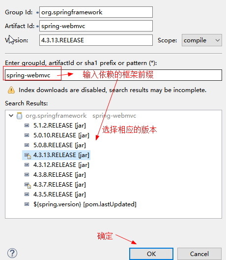
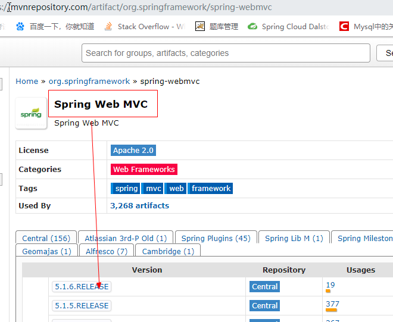
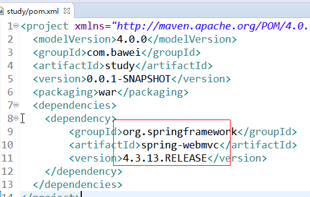
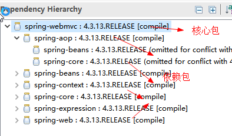
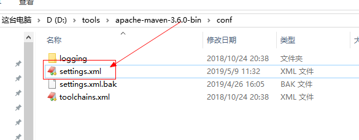

第二单元 Maven坐标体系与依赖
============================

【授课重点】
============

1.  五维坐标；

2.  依赖范围，传递，归类依赖，冲突调解，依赖排除；

3.  仓库；

【考核要求】
============

1.  坐标包含的内容

2.  依赖范围

3.  冲突解决的原则

4.  依赖范围对传递依赖的影响

【教学内容】
============

课堂导入
--------

前边已经学习了基本的使用

Maven坐标定义
-------------

坐标是maven 对jar 包的身份定义，所以每个maven 项目都需要定义本工程的坐标。如：

| \<!—项目名称 \<!-- 公司名称或组织名称 --\> \<groupId\>com.hrxb\</groupId\> \<!-- 项目或模块名称 --\> \<artifactId\>*attendmaven*\</artifactId\> \<!-- 项目或模块版本 --\> \<version\>0.0.1-SNAPSHOT\</version\> \<!-- 项目或模块的打包类型 war： web项目 jar :Java项目 *pom*:父工程设置为*pom* --\> \<packaging\>war\</packaging\> |
|------------------------------------------------------------------------------------------------------------------------------------------------------------------------------------------------------------------------------------------------------------------------------------------------------------------------------------|

依赖管理
--------

### 添加依赖的方式 

-   在pom.xml通过输入坐标添加依赖， 如添加spring-webmvc

| \<dependency\> \<groupId\>org.springframework\</groupId\> \<artifactId\>spring-webmvc\</artifactId\> \<version\>4.3.13.RELEASE\</version\> \</dependency\> |
|------------------------------------------------------------------------------------------------------------------------------------------------------------|

-   添加依赖的另一种方式

### 查找坐标

如果不知道依赖的坐标可以通过以下方式:

1.  在互联网<http://www.mvnrepository.com/>

### 依赖范围

传统的eclipse 构建项目过程如下

Compile: 编译 、测试、运行、打包 如spring 核心包 默认级别

Provided :编译、测试 需要；运行 、打包不需要 。如servlet-api.jar

Runtime: 编译不需要，测试、运行、打包需要 如数据库驱动包，编译时如果没有提供该
jar 包，程序也不会报错。

Test：编译，测试需要，运行，打包不需要 junit

### 依赖传递

在pom.xml 配置只spring-webmvc ，那么和spring-webmvc
相互依赖的包也会被引用过来。如

通过pom.xml中的下列操作

 Jar 包冲突的解决办法
---------------------

### Jar 包冲突的原因

MAVEN项目运行中如果报如下错误：

Caused by:java.lang.NoSuchMethodError

Caused by: java.lang.ClassNotFoundException

很有可能Maven jar包冲突造成的。那么jar包冲突是如何产生的？

假如存在以下依赖关系:

| A-\>B-\>C-\>D1(log 15.0)：A中包含对B的依赖，B中包含对C的依赖，C中包含对D1的依赖，假设是D1是日志jar包，version为15.0 E-\>F-\>D2(log 16.0)：E中包含对F的依赖，F包含对D2的依赖，假设是D2是同一个日志jar包，version为16.0 |
|-----------------------------------------------------------------------------------------------------------------------------------------------------------------------------------------------------------------------|
| 当pom.xml文件中引入A、E两个依赖后，根据Maven传递依赖的原则，D1、D2都会被引入，而D1、D2是同一个依赖D的不同版本。                                                                                                       |

当我们在调用D2中的method1()方法，而D1中是15.0版本（method1可能是D升级后增加的方法），可能没有这个方法，这样JVM在加载A中D1依赖的时候，找不到method1方法，就会报NoSuchMethodError的错误，此时就产生了jar包冲突。

### 解决办法

-   最短路径优先

Maven 面对 D1 和 D2 时，会默认选择最短路径的那个 jar 包，即 D2。E-\>F-\>D2 比
A-\>B-\>C-\>D1 路径短 1。

-   最先声明优先

如果路径一样的话，如： A-\>B-\>C1, E-\>F-\>C2 ，两个依赖路径长度都是
2，那么就选择最先声明

-   锁定原则

一般用在用多模块开发,在父项目中,声明需要的版本

### 排除冲突的jar

#### 工具排除

使用Maven Helper插件中的Dependency
Analyzer分析冲突的jar包，然后在对应标红版本的jar包上面点击execlude，就可以将该jar包排除出去

#### 手工排除

**案例**:

| 配置spring-context(4.3.13)的jar包依赖 配置spring-struts 的jar（3.0.5）包依赖 通过排除的方法,排除3.0.5版本的spring-beans |
|-------------------------------------------------------------------------------------------------------------------------|
|                                                                                                                         |

maven仓库分类
-------------

### 仓库之间工作流程

### 本地仓库

用来存储从远程仓库或中央仓库下载的jar 包. 项目中使用的jar， 从本地仓库中查找。

本地仓库默认位置：

\${user.home}/.m2/repository \${user.home}代表为当前windows用户

### 远程仓库

如果本地仓库没有需要的jar,则去远程仓库查找。远程仓库可以在局域网内，也可以在局域网外。

远程仓库可以理解为公司的私服，该仓库中的jar
有所在公司的人维护，服务于具体某个公司或组织。

### 中央仓库

在maven中设置一个远程仓库地址http://respo1.maven.org/maven2,

中央仓库服务与整个互联网，它是由Maven 团队维护，里面包含了非常全的jar 包。

### 配置本地仓库地址

在maven 的安装路径的 conf 下设置settings.xml

\<localRepository\>D:\\2017\\maven\\repository\</localRepository\>

表示本地的仓库地址为D:\\2017\\maven\\repository 该路径下
