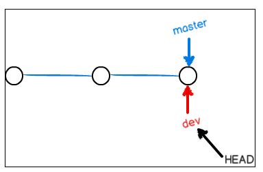
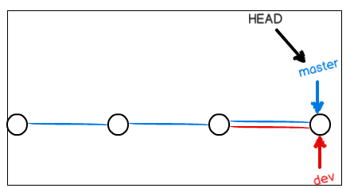
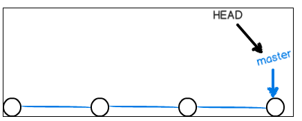
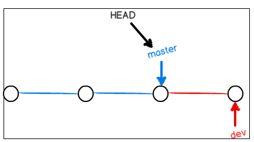
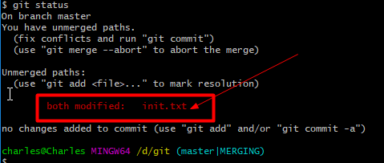
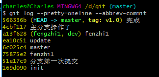
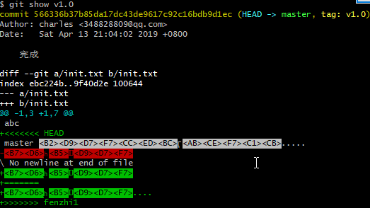

第六单元GIT 分支
================

【授课重点】
============

1.  代码冲突调解

2.  忽略文件

3.  标记

4.  分支

【考核要求】
============

1.  Git的分支概念

2.  代码冲突调解

3.  标记

4.  分支

【教学内容】
============

课程导入
--------

 GIT 分支管理
-------------

### 为什么要使用分支

使用分支意味着你可以把你的工作从开发主线上分离开来,以免影响主线的开发。分支在实际中有什么用呢？假设你准备开发一个新功能，但是需要两周才能完成，第一周你写了50%的代码，如果立刻提交，由于代码还没写完，不完整的代码库会导致别人不能干活了。如果等代码全部写完再一次提交，又存在丢失每天进度的巨大风险。

现在有了分支，就不用怕了。你创建了一个属于你自己的分支，别人看不到，还继续在原来的分支上正常工作，而你在自己的分支上干活，想提交就提交，直到开发完毕后，再一次性合并到原来的分支上，这样，既安全，又不影响别人工作。

其他版本控制系统如SVN等都有分支管理，但是用过之后你会发现，这些版本控制系统创建和切换分支比蜗牛还慢，简直让人无法忍受，结果分支功能成了摆设，大家都不去用。

但Git的分支是与众不同的，无论创建、切换和删除分支，Git在1秒钟之内就能完成！无论你的版本库是1个文件还是1万个文件。

###  分支的原理

一开始的时候，master分支是一条线，Git用master指向最新的提交，再用HEAD指向master，就能确定当前分支，以及当前分支的提交点

每次提交，master分支都会向前移动一步，这样，随着你不断提交，master分支的线也越来越长：

当我们创建新的分支，例如dev时，Git新建了一个指针叫dev，指向master相同的提交，再把HEAD指向dev，就表示当前分支在dev上：

Git创建一个分支很快，因为除了增加一个dev指针，改改HEAD的指向，工作区的文件都没有任何变化！

不过，从现在开始，对工作区的修改和提交就是针对dev分支了，比如新提交一次后，dev指针往前移动一步，而master指针不变：

假如我们在dev上的工作完成了，就可以把dev合并到master上。Git怎么合并呢？最简单的方法，就是直接把master指向dev的当前提交，就完成了合并：

所以Git合并分支也很快！就改改指针，工作区内容也不变！

合并完分支后，甚至可以删除dev分支。删除dev分支就是把dev指针给删掉，删掉后，我们就剩下了一条master分支：

分支实战
--------

###  创建分支

首先，我们创建dev分支，然后切换到dev分支

\$ git branch dev

\$ git checkout dev

上面两行命令也可以使用下边一行命令:

git checkout -b dev

git checkout命令加上-b参数表示创建并切换

###  查看分支

git branch

git
branch命令会列出所有分支，当前分支前面会标一个\*号。然后，我们就可以在dev分支上正常提交，比如对readme.txt做个修改，加上一行：

create new branch dev..

\$ git add readme.txt

\$ git commit -m "create new branch...."

[dev 45ae9a9] create new branch....

1 file changed, 1 insertion(+)

###  切换到master分支

\$ git checkout master

Switched to branch 'master'

切换回master分支后，再查看一个readme.txt文件，刚才添加的内容不见了！因为那个提交是在dev分支上，而master分支此刻的提交点并没有变：

###  合并分支

我们把dev分支的工作成果合并到master分支上

git merge dev

git
merge命令用于合并指定分支到当前分支。合并后，再查看readme.txt的内容，就可以看到，和dev分支的最新提交是完全一样的。注意到上面的Fast-forward信息，Git告诉我们，这次合并是“快进模式”，也就是直接把master指向dev的当前提交，所以合并速度非常快。

###  删除分支

git branch -d dev

在查看分支,只剩下 master

\$ git branch

\* master

###  小结

Git鼓励大量使用分支：

查看分支：git branch

创建分支：git branch \<name\>

切换分支：git checkout \<name\>

创建+切换分支：git checkout -b \<name\>

合并某分支到当前分支：git merge \<name\>

删除分支：git branch -d \<name\>

分支冲突
--------

### 制造冲突

合并分支往往也不是一帆风顺的。可能会有版本冲突

案例:

创建并切换到分支 :

\$ git checkout -b fenzhi1

在 init.txt 中添加一句话

[分支一的操作]

提交

git add init.txt

git commit -m “分支一”

切换到master分支

\$ git checkout master

改变init.txt.

添加一句话 , 主分支改变了

git add init.txt

git commit -m “主分支操作了”

这时,如果在合并fenzhi1,就会冲突

git merge fenzhi1

Git告诉我们，readme.txt文件存在冲突，必须手动解决冲突后再提交。git
status也可以告诉我们冲突的文件

git status

### 解决冲突

查看冲突的文件

Git用\<\<\<\<\<\<\<，=======，\>\>\>\>\>\>\>标记出不同分支的内容.

我们改变文件如下:

这时再执行命令

Git add init.text

Git commit -m “解决冲突”

GIT 标签
--------

打标签的作用，就是给项目的开发节点，加上语义化的名字，即功能版本的别名。  
打上标签名的同时，写上附带信息，可以方便项目日后维护过程中的回溯和复查。

注意:标签是打到commit上的.

命令git tag \<tagname\>用于新建一个标签，默认为HEAD，也可以指定一个commit id

###  创建标签

首先，切换到需要打标签的分支上

当前的分支是master

输入创建标签命令

git tag v1.0

###  查看标签

git tag

### 为历史提交打标签

默认标签是打在最新提交的commit上的。有时候，如果忘了打标签，比如，现在已经是周五了，但应该在周一打的标签没有打，怎么办？

方法是找到历史提交的commit id，然后打上就可以了：

git log --pretty=oneline --abbrev-commit

比方说要对update这次提交打标签，它对应的commit id是ea10c51，敲入命令：

\$ git tag v0.9 ea10c51

再查看标签

标签是按字母排序的,并不会按照打标签的顺序

### 查看标签信息

Git show \<tagname\>

例如

