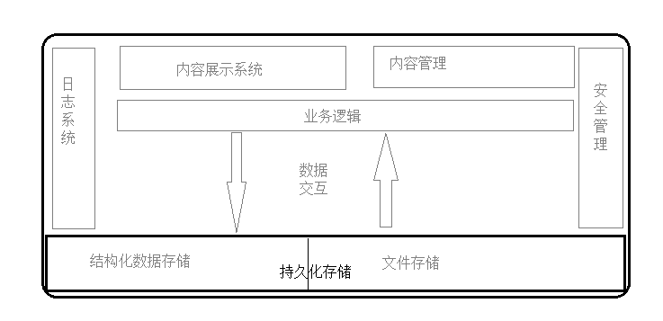
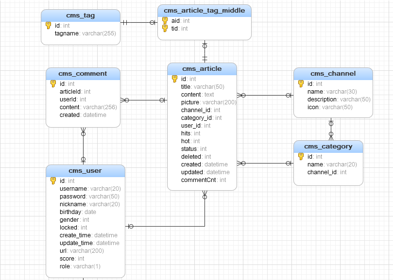
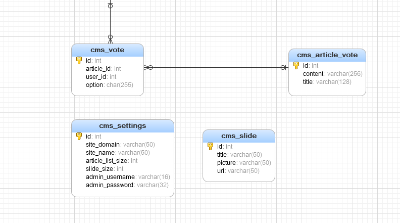

> # 【授课重点】
>
> 1. 系统架构的划分
> 2. 项目文件结构说明
> 3. 项目部署的方案
> 4. 数据建模说明
> 5. 数据校验方案
>
> # 【考核要求】
>
> 1. 熟悉系统架构的主要组成部分
> 2. 熟悉重要文件结构目录结构
> 3. 熟练掌握各个表、字段的含义
> 4. 掌握前端校验技术和jsr303校验技术
>
> # 【教学内容】
>
> # 课程导入  

​	上一章内容较多，需要对上涨内容进行消化。在前边学习的系统框架搭建基础之上完成后台前端框架的搭建。


# 11.1 系统架构设计

>   本项目根据业务需要，将架构按照如图所示架构，将数据存储、业务逻辑、数据展示、逻辑控制进行分离，同时项目引入日志管理系统以便项目后期维护和追踪，另外项目引入安全管理系统，保障系统数据安全可靠，防止数据的损坏、丢失或者泄露。



11.1.1 项目层次的划分
--------------

项目采用B/S架构，jsp与前后端分离相结合的模式，

-   表示层：

>   采用jsp+html+css+JQuery+bootstrap

-   控制层

>   采用Spring MVC中Controller进行控制页面逻辑关系。

-   业务逻辑层：

>   采用Spring MVC中Service进行业务处理及业务规则控制。

-   数据实体层：

>   采用POJO
>   的Model类及Mybatis进行数据持续化处理，即业务实体与其物理实体的映射。

-   资源层：

>   采用磁盘对图片资源或者其他文件类型数据资源进行管理。

-   后端架构Flow图

1：Controller控制动作

2：前端传递的参数（Json/对象）给控制层，控制层接收数据自动转换成（pojo）对象

3：控制层接受数据后传递业务层（Service层）。

3：Service层对数据进行处理，通过dao层与数据持久层进行数据交互。

4：流程图如下所示：


11.1.2 安全管理
--------

安全管理模块考虑内容主要以下几个层面：

1.防止注入

>   后台采用Mybatis避免SQL注入；

>   前端对可输入数据进行校验；

>   控制层在接受数据后对数据进行校验；

1.  非法篡改

>   用户分角色和权限

>   利用过滤器进行访问权限的控制。

11.1.3 重用性
------

将常用的类、方法封装成工具类，形成自己的工具包。

11.1.4 维护性
------

1：使用日志。

11.1.5 开发技术选型
------------

开发语言：Java/JavaScript等

开发工具：Eclipse J2ee Oxygen

构建工具：maven3.6.1

版本管理：git

框架选型：

>   Spring：5.1.5.RELEASE

>   mybatis：3.4.2

>   log41.2.17

>   Druid：1.0.9

>   Mysql:5.1.6

>   Mybatis_spring1.3.0

>   jackson2.9.1

>   hibernate-validator:6.0.10.Final

>   Jstl：1.2

>   servlet-api：2.5

>   jsp-api：2.0

>   commons-fileupload：1.3.1

>   Junit：4.12

>   aspectj-version：1.8.0

>   pagehelper-version：5.1.2

运行环境：

>   Jetty

>   Mysql

>   Linux/windows

 11.2 项目文件结构
=============

如下是工程的目录结构，其中目录中出现的mmcro是开发者的名字，要求开发人员根据自己的实际情况对其进行替换。

├─.settings // eclipse的工程的配置目录

├─src // 项目的所有的源码

│ ├─main //主目录，不包含单元测试代码

│ │ ├─java//Java源代码

│ │ │ └─com

│ │ │ └─mmcro

│ │ │ └─cms

│ │ │ ├─controller //控制层

│ │ │ ├─dao //dao层

│ │ │ ├─entity //实体bean

│ │ │ ├─service //service接口以及实现的目录

│ │ │ │ └─impl // service的实现

│ │ │ ├─utils // 本项目中的工具类

│ │ │ └─web //存放于web相关的内容，如拦截器、过滤器等

│ │ ├─resources //资源文件

>   │ db.properties // 数据库配置

>   │ log4j.properties // 日志配置

>   │ mybatis.xml // mybatis配置

>   │ spring-beans.xml // springbean

>   │ spring-mvc.xml //springmvc配置

│ │ └─webapp // web内容目录

│ │ ├─resource // 引入资源目录

│ │ │ ├─css //样式

│ │ │ │ └─jquery

│ │ │ ├─images // 图片资源

│ │ │ ├─js //js资源

│ │ │ ├─kindeditor //富文本编辑器

│ │ │ └─pic //图片资源

│ │ └─WEB-INF //

│ │ └─view // jsp 视图

│ │ ├─admin // 管理员内容

│ │ │ ├─article // 文章管理部分

│ │ │ └─user //用户管理部分

│ │ ├─common //通用的部分

│ │ ├─index //客户访问的视图

│ │ │ ├─article //文章

│ │ │ └─comment// 评论

│ │ ├─my // 个人中心

│ │ │ ├─article//个人文章管理

│ │ │ ├─comment//个人评论

│ │ │ └─vote //个人投票

│ │ ├─passport // 修改密码

│ │ └─user // 注册登录等

│ └─test // 测试的目录

│ ├─java //测试的源码目录

│ │ └─com

│ │ └─mmcro

│ │ └─cms

│ └─resources //测试的配置文件

└─target // maven构建编译的中间文件

11.3 部署方案设计
============

内容管理系统的部署需要，Web服务和Oracle服务器各一台。

Web服务器安装：apache、tomcat，配置域名并解析。

系统本身对配置要求不高，要考虑整个相关系统数据同步性能和数据库的压力。

11.4 开发框架
========

系统采用Java语言作为系统的主要开发语言，主要用J2EE定义的技术组件来搭建系统框架。展示层采用Jsp，控制层采用spring-mvc
，持久层采用Ibatis。

11.5 系统安全设计
============

 	1. 使用log4j 进行追踪
 	2. 使用事务保证数据一致性
 	3. 使用拦截器拦截不安全的访问

# 11.6 用户安全设计

1.  邮箱账户设计，按用户姓名拼音规则设置用户账户，如：张三，zhangsan；张三丰，zhangsf,
    用户账户在系统是唯一的，如果按照用户姓名系统出现相同的用户账户，可加“_”或数据处理，以做区分。
2.  用户账户的密码设计，用户的密码不能少于6位；账户做MD5加密处理。


11.7 数据建模
========

11.7.1 概述
----

本项目数据建模严格按照数据库第二范式，以保证数据的完整和准确性。项目中投票为可选功能，在时间允许的情况下可以完成，其他是必须完成功能。根据《CMS需求规格说明书》设计表结构，说明如下表格：

| 编号 | 表名称                 | 说明                                                                         |
|------|------------------------|------------------------------------------------------------------------------|
|      | cms_article            | 文章表                                                                       |
|      | cms_article_tag_middle | 文件与标签的中间表                                                           |
|      | cms_article_vote       | 投票内容表，某个用户或者管理员就某个事情发起投票，则投票内容保存在这个表中。 |
|      | cms_category           | 文章分类表                                                                   |
|      | cms_comment            | 评论表，数据为用户针对文章发表的评论                                         |
|      | cms_channel            | 频道表                                                                       |
|      | cms_settings           | 系统设置表，暂时未启用                                                       |
|      | cms_slide              | 幻灯片表                                                                     |
|      | cms_tag                | 标签表                                                                       |
|      | cms_user               | 用户表，管理员与注册用户均存放在这个表中                                     |
|      | cms_vote               | 投票表，暨用户针对那个投票内容进行的投票。                                   |

11.7.2  表结构数据字典说明
------------------

### 11.7.2.1 用户表

| 列名        | 类型     | 长度 | 小数点位数 | 是否允许为空 | 是否为主键 | 说明                |
|-------------|----------|------|------------|--------------|------------|---------------------|
| id          | int      | 11   | 0          | 否           | 是         |                     |
| username    | varchar  | 20   | 0          | 是           | 否         | 用户名称            |
| password    | varchar  | 50   | 0          | 是           | 否         | 密码，加盐加密      |
| nickname    | varchar  | 20   | 0          | 是           | 否         | 昵称                |
| birthday    | date     | 0    | 0          | 是           | 否         | 生日                |
| gender      | int      | 11   | 0          | 是           | 否         | 性别                |
| locked      | int      | 11   | 0          | 是           | 否         | 1:正常,0:禁用       |
| create_time | datetime | 0    | 0          | 是           | 否         | 注册时间            |
| update_time | datetime | 0    | 0          | 是           | 否         | 最后修改时间        |
| url         | varchar  | 200  | 0          | 是           | 否         | 外链个人主页        |
| score       | int      | 11   | 0          | 是           | 否         | 积分                |
| role        | varchar  | 1    | 0          | 是           | 否         | 0:普通用户,1:管理员 |

### 11.7.2.2  频道表

| 列名        | 类型    | 长度 | 小数点位数 | 是否允许为空 | 是否为主键 | 说明     |
|-------------|---------|------|------------|--------------|------------|----------|
| id          | int     | 11   | 0          | 否           | 是         |          |
| name        | varchar | 30   | 0          | 是           | 否         | 频道名称 |
| description | varchar | 50   | 0          | 是           | 否         | 描述     |
| icon        | varchar | 50   | 0          | 是           | 否         | 图标     |

### 11.7.2.3 分类表

| 列名       | 类型    | 长度 | 小数点位数 | 是否允许为空 | 是否为主键 | 说明         |
|------------|---------|------|------------|--------------|------------|--------------|
| id         | int     | 11   | 0          | 否           | 是         |              |
| name       | varchar | 20   | 0          | 是           | 否         | 名称         |
| channel_id | int     | 11   | 0          | 是           | 否         | 外键，频道id |

### 11.7.2.4 文章表

| 列名        | 类型     | 长度 | 小数点位数 | 是否允许为空 | 是否为主键 | 说明                             |
|-------------|----------|------|------------|--------------|------------|----------------------------------|
| id          | int      | 11   | 0          | 否           | 是         |                                  |
| title       | varchar  | 50   | 0          | 是           | 否         | 标题                             |
| content     | text     | 0    | 0          | 是           | 否         | 内容                             |
| picture     | varchar  | 200  | 0          | 是           | 否         | 标题图片                         |
| channel_id  | int      | 11   | 0          | 是           | 否         | 外键，频道表主键id               |
| category_id | int      | 11   | 0          | 是           | 否         | 外键，分类表主键Id               |
| user_id     | int      | 11   | 0          | 是           | 否         | 外键，用户表的主键id             |
| hits        | int      | 11   | 0          | 是           | 否         | 点击次数                         |
| hot         | int      | 11   | 0          | 是           | 否         | 是否热门                         |
| status      | int      | 11   | 0          | 是           | 否         | 0,刚发布,1审核通过,-1 审核未通过 |
| deleted     | int      | 11   | 0          | 是           | 否         | 1 表示删除，逻辑删除             |
| created     | datetime | 0    |            | 是           | 否         | 发布时间                         |
| updated     | datetime | 0    |            | 是           | 否         | 最后更新时间                     |
| commentCnt  | Int      | 11   |            | 是           | 否         | 评论数量                         |
|             |          |      |            |              |            |                                  |

### 11.7.2.5 标签表

| 列名    | 类型    | 长度 | 小数点位数 | 是否允许为空 | 是否为主键 | 说明 |
|---------|---------|------|------------|--------------|------------|------|
| id      | int     | 11   | 0          | 否           | 是         |      |
| tagname | varchar | 255  | 0          | 是           | 否         | 标签 |

### 11.7.2.6 文章标签关联表

| 列名 | 类型 | 长度 | 小数点位数 | 是否允许为空 | 是否为主键 | 说明   |
|------|------|------|------------|--------------|------------|--------|
| aid  | int  | 11   | 0          | 否           | 是         | 文章id |
| tid  | int  | 11   | 0          | 否           | 是         | 标签id |

### 11.7.2.7 文章评论表

| 列名      | 类型     | 长度 | 小数点位数 | 是否允许为空 | 是否为主键 | 说明     |
|-----------|----------|------|------------|--------------|------------|----------|
| id        | int      | 11   | 0          | 否           | 是         |          |
| articleId | int      | 11   | 0          | 是           | 否         | 文章ID   |
| userId    | int      | 11   | 0          | 是           | 否         | 用户id   |
| content   | varchar  | 256  | 0          | 是           | 否         | 评论内容 |
| created   | datetime | 0    | 0          | 是           | 否         | 发布时间 |

### 11.7.2.8 投票内容表

| 列名    | 类型    | 长度 | 小数点位数 | 是否允许为空 | 是否为主键 | 说明 |
|---------|---------|------|------------|--------------|------------|------|
| id      | int     | 11   | 0          | 否           | 是         |      |
| content | varchar | 256  | 0          | 是           | 否         |      |
| title   | varchar | 128  | 0          | 是           | 否         |      |

### 11.7.2.9 投票表

| 列名       | 类型 | 长度 | 小数点位数 | 是否允许为空 | 是否为主键 | 说明 |
|------------|------|------|------------|--------------|------------|------|
| id         | int  | 11   | 0          | 否           | 是         |      |
| article_id | int  | 11   | 0          | 是           | 否         |      |
| user_id    | int  | 11   | 0          | 是           | 否         |      |
| option     | char | 255  | 0          | 是           | 否         |      |

### 11.7.2.10  轮播图表（幻灯片）

| 列名    | 类型    | 长度 | 小数点位数 | 是否允许为空 | 是否为主键 | 说明 |
|---------|---------|------|------------|--------------|------------|------|
| id      | int     | 11   | 0          | 否           | 是         |      |
| title   | varchar | 50   | 0          | 是           | 否         |      |
| picture | varchar | 50   | 0          | 是           | 否         |      |
| url     | varchar | 50   | 0          | 是           | 否         |      |

### 11.7.2.11 系统设置表

| 列名              | 类型    | 长度 | 小数点位数 | 是否允许为空 | 是否为主键 | 说明 |
|-------------------|---------|------|------------|--------------|------------|------|
| id                | int     | 11   | 0          | 否           | 是         |      |
| site_domain       | varchar | 50   | 0          | 是           | 否         |      |
| site_name         | varchar | 50   | 0          | 是           | 否         |      |
| article_list_size | int     | 11   | 0          | 是           | 否         |      |
| slide_size        | int     | 11   | 0          | 是           | 否         |      |
| admin_username    | varchar | 16   | 0          | 是           | 否         |      |
| admin_password    | varchar | 32   | 0          | 是           | 否         |      |

 11.7.3  E-R图
------





 11.8 数据校验
=========

11.8.1 前端数据校验
------------

### 11.8.1.1 概述

>   使用jQuery validate

### 11.8.1.2 使用办法

1、jQuery validate的使用

引入包

<script type="text/javascript" src="/script/jquery.min.js"></script>
<script type="text/javascript" src="/script/jquery.validate.min.js"></script>
<script src="/dist/localization/messages_zh.js"></script>


2、页面或CSS样式中增加高亮显示错误

​	

```css
.error{

			color:red;

		}


```


4、需要校验的页面增加

<script>

```javascript
	$().ready(function() {

		$("#form").validate();

	});

	</script> 
	
```

>   5、在每个录入栏目目中增加规则

​	 

```javascript
<li>

<span class="dis">用户名:</span>

           <input type="text" name="userName" id="userName" 

              minlength="4" maxlength="24"  

 remote="/user/checkName" required>

</li>
```


>   6、校验

>   A） 直接提交 在提交的时候会自动校验该表单中的内容是否合法，如果不合法
>   则以高亮的形式显示错误
>
>   ```javascript
>    
>   
>   	 $("#form").submit();	
>   ```
>
>   


>   B）ajax
>   提交，这种提交方式需要先手动调用validate方法，如果通过则调用ajax提交，否则停留在当前的页面


```javascript
	// 手动验证 然后提交

	function commitShoudong(){

				 if(!$("#form").valid()){

					return;

				} 

				 $("#form").submit();

			}
```


1.  支持的校验规则

​       1.  required:true 必输字段 


2.  remote:"check.jsp" 使用ajax方法调用check.jsp验证输入值

3.  email:true 必须输入正确格式的电子邮件

4.  url:true 必须输入正确格式的网址

5.  date:true 必须输入正确格式的日期 日期校验ie6出错，慎用

6.  dateISO:true 必须输入正确格式的日期(ISO)，例如：2009-06-23，1998/01/22
    只验证格式，不验证有效性

7.  number:true 必须输入合法的数字(负数，小数)

8.  digits:true 必须输入整数

9.  creditcard: 必须输入合法的信用卡号

10. equalTo:"\#field" 输入值必须和\#field相同

11. accept: 输入拥有合法后缀名的字符串（上传文件的后缀）

12. maxlength:5 输入长度最多是5的字符串(汉字算一个字符)

13. minlength:10 输入长度最小是10的字符串(汉字算一个字符)

14. rangelength:[5,10] 输入长度必须介于 5 和 10 之间的字符串")(汉字算一个字符)

15. range:[5,10] 输入值必须介于 5 和 10 之间

16. max:5 输入值不能大于5

17. min:10 输入值不能小于10

11.8.2 后端数据校验
------------

### 11.8.2.1 引入依赖

>   ​	
>
>   ```xml
>      <dependency>
>   
>   			<groupId>org.hibernate</groupId>
>   
>   			<artifactId>hibernate-validator</artifactId>
>   
>   			<version>5.2.4.Final</version>
>   
>   	</dependency>
>   ```
>
>   

### 11.8.2.2 使用校验规则 

在实体Bean上使用注解方式增加校验规则

```java
public class User implements Serializable {

	    @Length(max=10,min=5,message="哎呀，长度不合适啊")

	     private String name;

	}
```


###  11.8.2.3 控制层的处理

修改提交的controller 当中的响应函数 重要的点：@Validated

```java
@RequestMapping(value="register",method=RequestMethod.POST)

	public String register(HttpServletRequest rquest,@Validated @ModelAttribute("user") User user,

			BindingResult result) {

		

	}
```

Jsp视图层的处理

视图jsp引入form 标签：

```jsp
<%@ taglib prefix="form" uri="http://www.springframework.org/tags/form"%>

      使用form 标签  modelAttribute 中的属性值 必须与 3 中的ModelAttribute参数值一模一样

       <form:form id="form" modelAttribute="user" action="register" method="post">

			<!-- 这里是输入内容  -->

			<form:input type="password" path="passwd" name="passwd" id="passwd"/>

			<!-- 这里是如果有错误 则返回的错误  -->

		    <form:errors path="passwd" cssClass="errorMsg"></form:errors> 
	  </form:form>
```


>   使用form 标签 modelAttribute 中的属性值 必须与 3
>   中的ModelAttribute参数值一模一样

如果jsp 是由跳转过来的 则 modelAttribute
的属性必须要有值。可以在条状到这个页面之前赋值即可。

比如：

```java
@RequestMapping(value="register",method=RequestMethod.GET)

public String register(HttpServletRequest rquest,HttpSession session) {

		rquest.setAttribute("user",new User());

	return "register1";

}
```

4、jsp 的修改

\<form:form id="form" modelAttribute="user" action="register" method="post"\>

\<!-- 这里是输入内容 --\>

\<form:input type="password" path="passwd" name="passwd" id="passwd"/\>

\</form:form\>

//ajax 提交并返回错误的结果 验证的方式

function commitajax(){

\$.ajax({

url:"registerajax",

type:"post",

data:\$("\#form").serialize(),

success:function(data){ // 返回的错误信息的列表

if(data.length\<=0){

alert('提交成功')

}else{

// 对返回的错误进行解析

for ( var i in data) {

// 拼接字符串 包含了表单输入框的名称 以及 错误信息

var strJson = '{"'+data[i].field + '":"' + data[i].defaultMessage + '"}'

// 转换成对象

alert(strJson)

var obj = \$.parseJSON( strJson);

// 将错误显示在输入框的后边

validate.showErrors(obj)

}

}

}

})

}

### 11.8.2.4 异步提交后台处理

>   controller 的提交地址

\@RequestMapping(value="registerajax",method=RequestMethod.POST)

\@ResponseBody

public List\<ObjectError\> registerajax(HttpServletRequest rquest,

\@Validated \@ModelAttribute("user") User user,

BindingResult result) {

rquest.getSession().getAttribute(P2PContant.CODE);// hard code

if("123456".equals(user.getPasswd())) {

result.rejectValue("passwd", "ming", "密码太简单啦o！");

}

return result.getAllErrors();

}

11.9 协议
====

这里主要强调页面接收后台返回的的json数据格式。要求后端返回的数据格式如下：

{

"result": 1,

"errorMsg": "获取数据成功",

"data": ...

}

键result 含义：处理结果 1表示后端处理成功，其他数值表示处理失败，不同数值
代表不同含义，由开发人员自定义。

键errorMsg 含义：当处理结果不正确的时候，错误信息，用于提示用户。

键data 含义：返回给前端的数据。


# 11.10 课后总结

 	1. 讲解了系统架构的划分
 	2. 对项目文件结构进行了说明
 	3. 介绍了项目部署的方案
 	4. 数据模型进行了详细的讲解
 	5. 数据校验方案简要复习

# 11.11 课后作业

1. 理解项目架构
2. 做本地域名解析
3. 数量掌握本地数据模型
4. 用户注册的前端校验和后端校验

# 