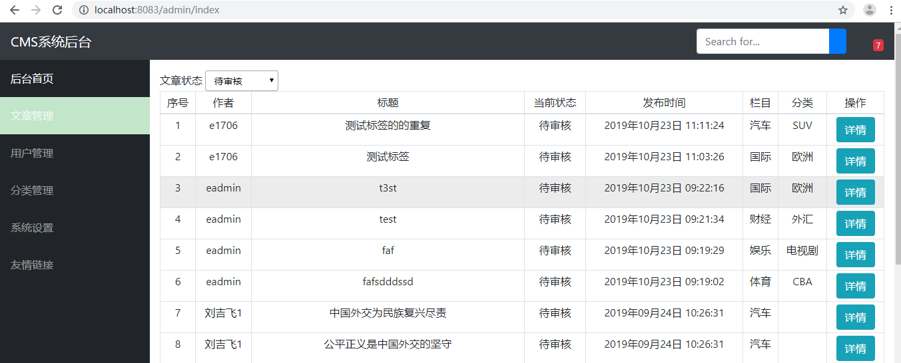

>   # 【授课重点】
>
>   1. 利用bootsrap 搭建后台框架
>   2. 完成导航添加
>   3. 完成左侧菜单栏
>   4. 实现菜单滑动效果
>   5. 实现动态内容加载
>
>   # 【考核要求】
>
>   1. 利用bootstrap 实现常见布局
>   2. 导航的使用
>   3. 菜单栏以及滑过效果的实现
>   4. 动态内容的加载
>
>   # 【教学内容】
>
>   # 课程导入  

​	上一章内容较多，需要对上涨内容进行消化。在前边学习的系统框架搭建基础之上完成后台前端框架的搭建。

## 12.1 前端

>   实现效果如图所示：



>   页面使用bootstap实现。

>   页面主要分为三部分分别为顶部、左侧功能导航和右侧工作区。

### 12.1.1 顶部

>   需要实现下拉式的导航栏。

>   实现的功能包含返回主页、进入修改密码功能和退出登录等操作。

>   实现的代码如下：

>   ```html
>    <ul class=*"navbar-nav ml-auto ml-md-0"*>
>   
>    <li class=*"nav-item dropdown no-arrow mx-1"*>
>   
>    <a class=*"nav-link"* href=*"#"* id=*"messagesDropdown"* role=*"button"*
>    aria-haspopup=*"true"* aria-expanded=*"false"*>
>   
>    <i class=*"fas fa-envelope fa-fw"*></i>
>   
>    <span class=*"badge badge-danger"*>7</span>
>   
>    </a>
>   
>    </li>
>   
>    <li class=*"nav-item dropdown no-arrow"*>
>   
>    <a class=*"nav-link dropdown-toggle"* href=*"#"* id=*"userDropdown"*
>    role=*"button"* data-toggle=*"dropdown"* aria-haspopup=*"true"*
>    aria-expanded=*"false"*>
>   
>    <i class=*"fas fa-user-circle fa-fw"*></i>
>   
>    </a>
>   
>    <div class=*"dropdown-menu dropdown-menu-right"*
>    aria-labelledby=*"userDropdown"*>
>   
>    <a class=*"dropdown-item"* href=*"#"*>返回网站</a>
>   
>    <a class=*"dropdown-item"* href=*"#"*>修改密码</a>
>   
>    <div class=*"dropdown-divider"*></div>
>   
>    <a class=*"dropdown-item"* href=*"/user/logout"* >退出</a>
>   
>    </div>
>   
>    </li>
>   
>    </ul>
>   
>    </nav>
>   ```
>
>   

### 12.1.2 左侧

>   左侧导航使用bootstrap 的实现。代码基本样式为：

>    <ul class=*"sidebar navbar-nav"* >
>    
>
>   ```html
>   <li class=*"nav-item"*><a class=*"nav-link"* href=*"javascript:void(0)"
>    data*=*"/admin/manArticle"*>
>   
>    <i class=*"fas fa-fw fa-folder"*></i> <span>文章管理</span>
>   
>    </a></li>
>   
>    。。。。。。。。。。。。。
>   
>   </ul>
>   ```
>
>
>   
>

>   在整个页面加载完成后执行预加载函数，为每个li中的超链接增加点击事件，当点击以后右侧的工作区提供相应的操作。实现的代码如下：

 

```javascript
$('.nav-link').click(function(){

 //获取当前默认高亮的属性

 var li = $('.nav-link.active');

 //移除目前高亮的样式

 li.removeClass('active');

 //为当前点击行添加高亮的样式

 $(this).addClass('active');

 //获取点击的的*url*

 var url = $(this).attr('data');

 //在中间区域显示地址的内容

 $('#content-wrapper').load(url);

 })
```


## 12.2 后端

这里不涉及后端的代码的实现。

## 12.3 参考文献


## 12.4 课堂总结

1. 利用bootstrap 布局一个管理页面
2. 利用hover实现菜单的滑动效果
3. 利用load动态内容的加载

## 12.4 课后作业

1. 利用bootstrap 布局一个管理页面
2. 菜单栏以及滑过效果的实现
3. 动态内容的加载