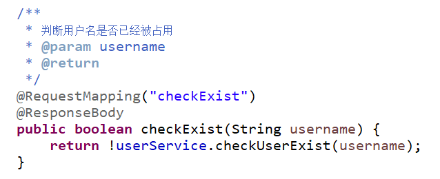
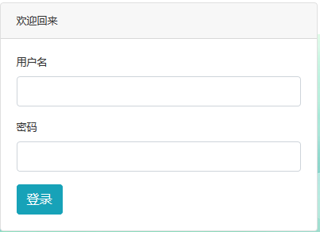
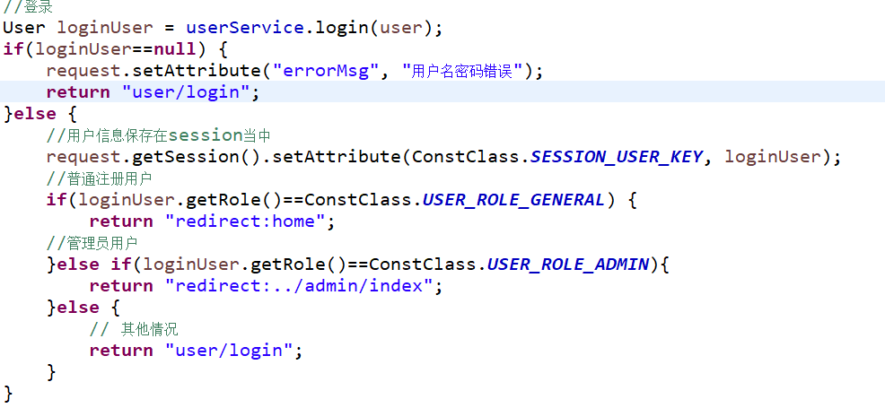

注册登录以及拦截器

14.1 用户注册
========

实现效果要求：


14.1.1 前端
----

实现说明：

使用bootstrap 实现上述jsp页面，使用jqueryValidate 和 hibernate 进行数据校验。

输入：

用户名、密码、性别、点击注册

性别在页面中用数字1、2分别代表男、女。

输出：

注册成功跳转到用户登录页面，否则保持当前页面并提示错误信息。

校验：

-   用户名不能为空

-   密码不能为空

-   用户名不重复

    -   用户名称输入标签中增加属性：

>   *remote*=*"/user/checkExist"，*其中*checkExist*是后端提供的判断用户名是否已经存在的服务接口。

异常处理：

异常跳转到异常显示页面。

14.1.2 后端
----

### 14.1.2.1 控制层

-   进入注册页面

>   \@GetMapping("register") // 只接受get的请求

**public** String register() {

**return** "user/register";

}

-   注册请求


-   同名用户校验



### 14.1.2.2  服务层

-   注册


-   判断用户是否存在


### 14.1.2.3 工具类

-   前提

>   使用MD5加密引入工具包即可，在此基础之上再封装。Maven工程引入工具包：


-   MD5加盐加密


### 14.1.2.4 数据层

-   根据名称查找用户


-   添加用户


14.2 登录
====

14.2.1 前端
----

实现效果如图：



实现说明：

使用bootstrap 实现上述jsp页面。

输入：

用户名、密码、点击登录

输出：

跳转到后台管理页面

校验：

-   用户名不能为空

-   密码不能为空

异常处理：

异常跳转到异常显示页面。

14.2.2 后端
----

### 14.2.2.1  控制层

-   进入登录页面

>   \@GetMapping("login")

>   **public** String login() {

>   //Todo

>   }

-   登录请求

>   \@PostMapping("login")

>   **public** String login(HttpServletRequest request,User user) {

>   // todo

>   // 调用service相应的方法，

>   //如果登录成功 则保存数据到session当中，并跳转到管理中心

>   }

>   否则继续显示登录页面，并且返回错误信息。代码如下：



>   }
>
>   

### 14.2.2.2  服务层

| **public** User login(User user) { |
|------------------------------------|


>   //根据用户名查找用户，返回的用户对象密码密文与与参数中的用户明文加密后的结果进行对比，如果一样则返回用户对象，意为登录成功，否则认为用户不存在，登录失败。


>   }


### 14.2.2.3  数据层


14.3 拦截器
======

14.3.1 代码实现
--------

~~~java

```
/**
```

- 权限拦截器

- @author zhuzg

- */
  public class AuthIntercepter implements HandlerInterceptor {

  /**

  - */
    public boolean preHandle(HttpServletRequest request, 
    	HttpServletResponse response, Object handler)
    	throws Exception {

    //session 中获取存在用户
    User loginUser = (User)request.getSession().getAttribute(
    		ConstClass.SESSION_USER_KEY);
    //不存在  则不放行
    if(loginUser==null) {
    	// 跳转到登录页面，这里也可以使用重定向 
    	request.getRequestDispatcher("/user/login").
    		forward(request, response);
    	return false;
    }
    //放行
    return true;
    }

}
~~~


14.3.2 配置
----

​	

<!-- 配置权限的拦截器 -->
	<mvc:interceptors>
		<mvc:interceptor>
			<!-- 配置拦截的资源 -->
			<mvc:mapping path="/**"/>
			<!-- 配置排除的拦截资源 -->
			<mvc:exclude-mapping path="/html/**"/>
			<mvc:exclude-mapping path="/resource/**"/>
			<mvc:exclude-mapping path="/article/show"/>
			<mvc:exclude-mapping path="/article/comment"/>
			<mvc:exclude-mapping path="/article/getclist"/>
			<mvc:exclude-mapping path="/article/addHits"/>
			<mvc:exclude-mapping path="/pic/**"/>
			<mvc:exclude-mapping path="/"/>
			<mvc:exclude-mapping path="/index"/>
			<mvc:exclude-mapping path="/user/login"/>
			<mvc:exclude-mapping path="/user/register"/>
			<mvc:exclude-mapping path="/user/checkExist"/>
			<!-- 拦截器的实现类 -->
			<bean class="com.mmcro.cms.web.AuthIntercepter"></bean>
		</mvc:interceptor>
	</mvc:interceptors>

