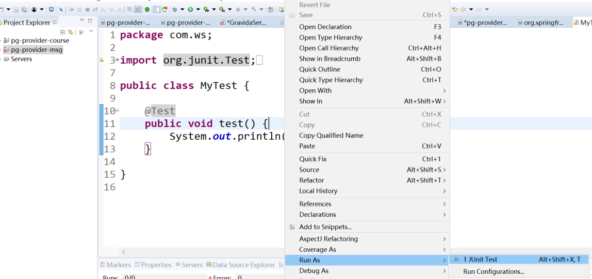
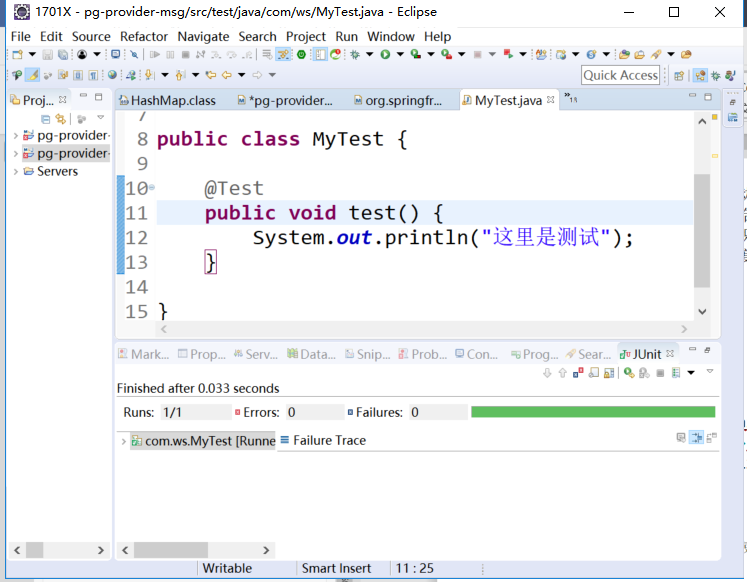
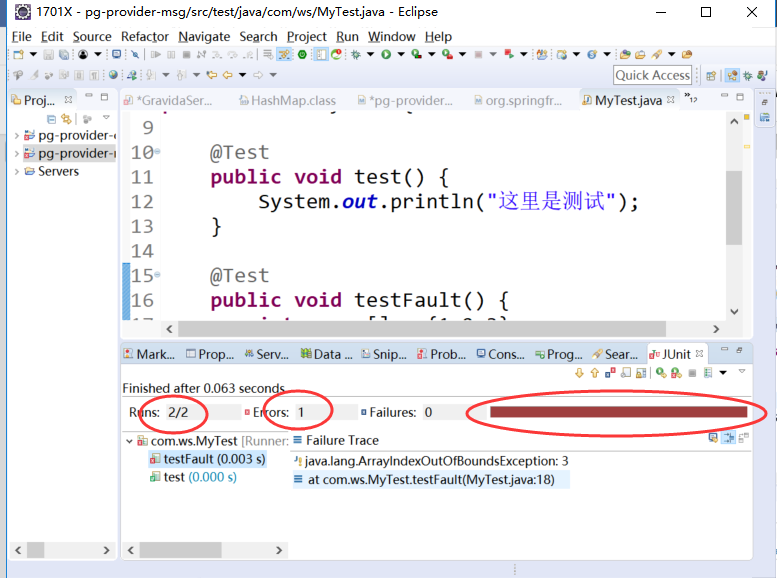

第十八单元  项目测试
=======================

【授课重点】 
=============

1.  jUnit框架结构

2.  Maven工程引入jUnit依赖

3.  jUnit常用注解

4.  jUnit与Spring-Test集成

【考核要求】
============

1.  理解jUnit框架结构

2.  熟练掌握Maven工程引入jUnit依赖

3.  熟练掌握jUnit常用注解

4.  熟练使用jUnit与Spring-Test集成

【教学内容】
============

18.1 课程导入
--------

### 18.1.1  为什么要测试

在计算的整个历史中，软件和系统投入运行后，由于存在缺陷，随后导致故障或无法满足利害关系方的需要，这种现象很常见。但是，使用适当的测试技术可以减少这种有问题交付的频率，只要这些技术是在适当的测试技能、适当的测试级别和软件开发生命周期的适当时间点上应用的。每个人都会犯错误（Error、Mistake），而错误会导致在软件代码或者其他一些相关工作产品中引入缺陷（defect、fault或bug）。导致在一个工作产品中引入缺陷的错误可以触发另外一个导致相关工作产品中引入缺陷的错误。

针对任何给定项目，其测试目标包括：  
• 评估工作产品，例如：需求、用户故事、设计和代码  
• 验证是否已满足所有描述的需求  
• 确认测试对象是否完整，并按照用户和其它利益相关者的预期工作  
• 建立对测试对象质量级别的信心  
• 预防缺陷  
• 发现失效和缺陷  
• 为利益相关者提供足够的信息帮助他们做出合适的决定，尤其是考虑测试对象的质量级别  
• 降低软件质量低下的风险级别（例如：运行环境中出现了之前未被发现的失效）  
• 符合合同、法律或者法规的需求或者标准，和/或验证测试对象符合这些需求或者标准  
测试的目标可以有所不同，这取决于被测组件或系统的上下文、测试级别和软件开发生命周期模型。例如：  
•
组件测试时，一个目标可能是发现尽可能多的失效，以便及早识别和修复潜在的缺陷。另一个目标可能是增加组件测试的代码覆盖率。  
•
验收测试时，一个目标可能是确认系统按照预期工作并满足要求。测试的另一个目的可能是向利益相关者提供在指定时间发布系统的风险信息。

### 18.1.2 应用场景

项目开发过程中

项目开发结束

项目验收

项目后期维护

18.2 Junit介绍
---------

### 18.2.1 单元测试

测试是检查应用程序是否是工作按照要求，并确保在开发者水平，单元测试进入功能性的处理。单元测试在每一个软件公司开发高品质的产品给他们的客户是十分必要的。两种方式来完成：

-   手动测试

费时和乏味：由于测试案例是由人力的，所以它是非常缓慢而乏味的执行。

巨大的人力资源的投入：作为测试用例需要手动执行，所以更多的测试都需要手动测试。

较不可靠：手动测试是为测试可能不会被精确地每次执行，因为人为错误导致不可靠。

· 非可编程：无需编程就可以做，获取信息隐藏复杂的测试。

-   自动测试

快速自动化运行测试用例比人力显著更快。

人力资源的投入较少：测试用例是通过使用自动化工具，所以较少测试者都需要在自动化测试执行。

更可靠：自动化测试在每次运行的时间进行精确的相同操作。

编程：测试人员可以编写复杂的测试，以带出隐藏的信息。

### 18.2.1 jUnit 是什么

JUnit是一个Java编程语言编写的单元测试框架。
重要的是在测试驱动开发中，并且是一个家族的统称为xUnit单元测试框架中的一个。

### 18.2.3  jUnit特点

-   JUnit是用于编写和运行测试的开源框架。

-   提供了注释，以确定测试方法。

-   提供断言测试预期结果。

-   提供了测试运行的运行测试。

-   JUnit测试让您可以更快地编写代码，提高质量

-   JUnit是优雅简洁。它是不那么复杂以及不需要花费太多的时间。

-   JUnit测试可以自动运行，检查自己的结果，并提供即时反馈。没有必要通过测试结果报告来手动梳理。

-   JUnit测试可以组织成测试套件包含测试案例，甚至其他测试套件。

-   Junit显示测试进度的，如果测试是没有问题条形是绿色的，测试失败则会变成红色。

18.3 Maven 集成 jUnit
----------------

### 18.3.1 引入依赖

>   \<dependency\>

\<groupId\>*junit*\</groupId\>

\<artifactId\>*junit*\</artifactId\>

\<version\>4.12\</version\>

>   \</dependency\>

### 11.3.2 入门案例

编写如下代码并单击右键使用junit 运行。

运行结果如下，表示运行成功。

在上述的代码基础之上增加代码

>   \@Test

>   **public void** testFault() {

>   **int** array[] = {1,2,3};

>   System.*out*.println("这里是测试" + array[3]);

>   }

并运行结果如下：

18.4 jUnit常用注解
-------------

### 18.4.1  @Test

@Test

public void method()

测试注释指示该公共无效方法它所附着可以作为一个测试用例。

### 18.4.2 @Before 

@Before

public void method()

Before注释表示，该方法必须在类中的每个测试之前执行，以便执行测试某些必要的先决条件。

### 18.4.3 @BeforeClass 

@BeforeClass

public static void method()

BeforeClass注释指出这是附着在静态方法必须执行一次并在类的所有测试之前。发生这种情况时一般是测试计算共享配置方法(如连接到数据库)。

### 18.4.4 @After 

@After

public void method()

After
注释指示，该方法在执行每项测试后执行(如执行每一个测试后重置某些变量，删除临时变量等)

### 18.4.5 @AfterClass 

@AfterClass

public static void method()

当需要执行所有的测试在JUnit测试用例类后执行，AfterClass注解可以使用以清理建立方法，(从数据库如断开连接)。注意：附有此批注(类似于BeforeClass)的方法必须定义为静态。

### 18.4.6 @Ignore 

@Ignore

public static void method()

当想暂时禁用特定的测试执行可以使用忽略注释。每个被注解为\@Ignore的方法将不被执行。

18.5 JUnit断言
----------

void assertEquals([String message], expected value, actual value)

断言两个值相等。值可能是类型有 int, short, long, byte, char or java.lang.Object.
第一个参数是一个可选的字符串消息

void assertTrue([String message], boolean condition)

断言一个条件为真

void assertFalse([String message],boolean condition)

断言一个条件为假

void assertNotNull([String message], java.lang.Object object)

断言一个对象不为空(null)

void assertNull([String message], java.lang.Object object)

断言一个对象为空(null)

void assertSame([String message], java.lang.Object expected, java.lang.Object
actual)

断言，两个对象引用相同的对象

void assertNotSame([String message], java.lang.Object unexpected,
java.lang.Object actual)

断言，两个对象不是引用同一个对象

void assertArrayEquals([String message], expectedArray, resultArray)

断言预期数组和结果数组相等。数组的类型可能是 int, long, short, char, byte or
java.lang.Object.

18.6 在命令行中运行JUnit测试
-----------------------

public class AssertionsTest {

>   @Test

>   public void test() {

>   }

}

18.7 jUnit与spring-test集成
----------------------

### 18.7.1 引入依赖

>   pom.xml 中引入依赖，如下所示：

\<dependency\>

\<groupId\>org.springframework\</groupId\>

\<artifactId\>spring-test\</artifactId\>

\<version\>4.3.10.RELEASE\</version\>

\</dependency\>

### 18.7.2 使用注解

在测试类前增加两个注解，分别是：

-   RunWith

-   ContextConfiguration

>   RunWith：

>   表示使用那个类启动测试。

>   ContextConfiguration

>   加载配置文件，通过加载配置可以使用spring中的注解。
