第一单元Maven 入门
==================

【授课重点】
============

1.  Maven介绍，安装，配置，常用命令；
2.  Eclipse的Maven插件介绍、配置；
3.  第一个Maven程序；
4.  Eclipse中来执行maven命令；

【考核要求】
============

1.  maven命令

2.  maven项目的目录结构

3.  maven对项目管理的好处

4.  Jdk的配置,maven的配置

【教学内容】
============

1.1 课程导入
--------

>   1、在前面学习的过程中，需要jar包，需要手动拷贝。

>   2、jar版本的管理？

>   3、如何打包？ 如果自己的打包供他人使用？

1.2 Maven介绍
---------

Maven是Apache 下开源的、纯java开发的一个项目管理工具。使用Maven
对项目进行构建、依赖管理。

### 1.2.1 什么是项目构建

项目构建是一个项目从编写代码、编译、测试、运行、打包、部署、运行的过程。

### 1.2.2 传统的eclipse 构建项目步骤

1.  在eclpise 中创建WEB 项目

2.  在工程中编写源代码和配置文件

3.  对源代码进行编译，即JAVA 文件编译成class 文件（一般eclipse自动编译）

4.  Junit 单元测试

5.  将工程打成war 包部署至tomcat运行

### 1.2.3 Maven 构建项目步骤

>   Maven
>   对项目的每个过程进行标准化管理，使用一个命令就可以完成一个标准过程，从而简化项目过程。

1.  compile :Java文件编译成.class文件

2.  clean : 清理class文件

3.  package :java 工程打包成jar 文件，web 工程打包成war文件

4.  tomcat7:run 运行一个web工程

### 1.2.4 什么是依赖管理

-   什么是依赖

>   一个java 项目需要第三方的JAR 支持，才能运行，那么该项目就依赖的了第三方jar
>   包

-   什么是依赖管理

>   对项目依赖的JAR 包进行规范化管理.

### 1.2.5 传统项目和maven项目管理比较

-   传统项目

需要人工添加相关第三方的jar到项目中，这样可能存在的问题

1.  没有对Jar 包版本的统一进行管理，容易造成版本冲突

2.  Jar 包不容易找到

3.  Jar 包添加到工程中，导致工程过大

-   Maven 项目

>   Maven 项目不需要手工添加jar 到项目中，开发人员只需要维护pom.xml配置文件，
>   在配置文件中维护jar包的坐标，maven会自动从仓库中下载jar、运行。

好处：

1.  Pom.xml 中版本统一，不会出现冲突的问题

2.  Maven 团队维护jar 文件，当前使用jar 包，maven仓库中都有，使用方便。

### 1.2.6 使用maven 的好处

1.  依赖管理

2.  一步构建

3.  Maven 跨平台，可在windows,linux上运行

4.  Maven 遵循开发规范，有利于提高大型团队的开发效率，降低维护成本

1.2 Maven 安装与配置
----------------

### 1.2.1 下载安装

-   下载路径<http://maven.apache.org/>

-   解压到不含中文和空格的目录

### 1.2.2 配置maven环境变量

-   设置环境变量

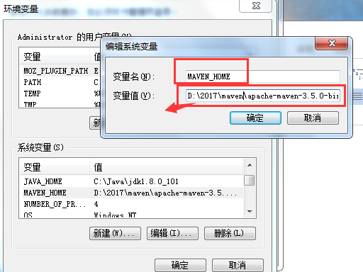

>   命令行下执行

>   echo %M2_HOME%

查看结果

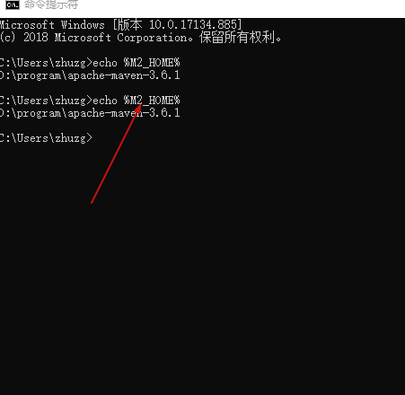

-   添加到path

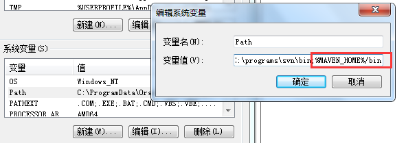

-   测试

>   运行 cmd进入,输入mvn –v 如果提示下图，则配置成功

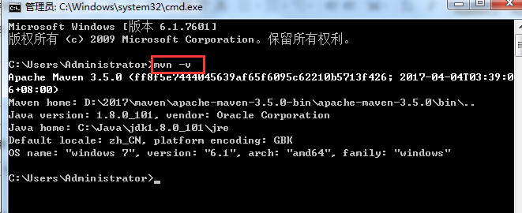

1.3 Maven 工作流程
--------------

### 1.3.1 流程图

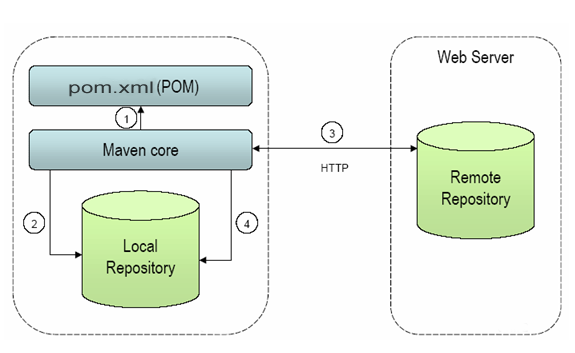

### 1.3.2 流程描述

maven 解析 在pom.xml 文件，根据坐标去本地仓库（local repository）中找寻需要的jar
,如果本地仓库中没有，则自动通过互联网去远程仓库（remote repository）中下载需要的
jar 到本地仓库中。本地仓库可以理解为缓存.

如果要想从外网上下载，需要

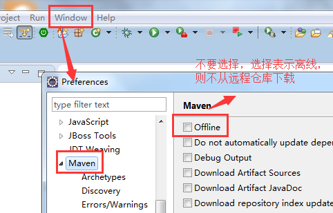

1.4 maven仓库分类
-------------

### 1.4.1 仓库之间工作流程

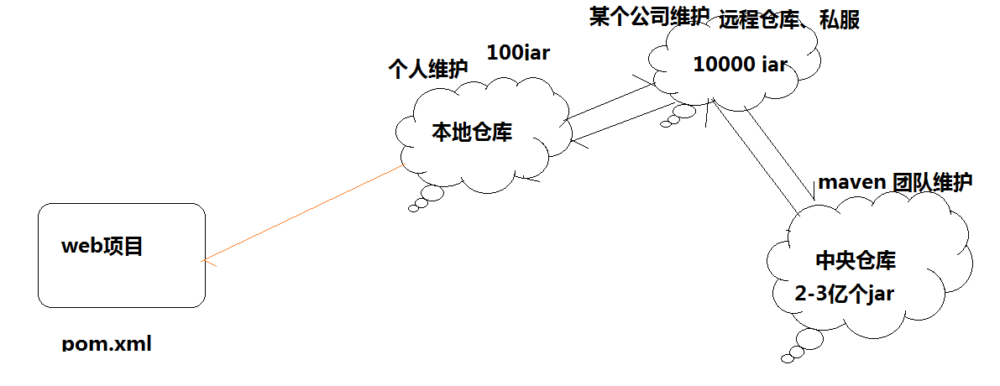

### 1.4.2 本地仓库

用来存储从远程仓库或中央仓库下载的jar 包. 项目中使用的jar， 从本地仓库中查找。

本地仓库默认位置：

\${user.home}/.m2/repository \${user.home}代表为当前windows用户

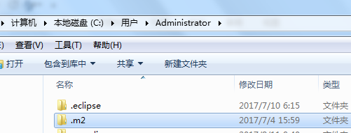

### 1.4.3 远程仓库

如果本地仓库没有需要的jar,则去远程仓库查找。远程仓库可以在局域网内，也可以在局域网外。

远程仓库可以理解为公司的私服，该仓库中的jar
有所在公司的人维护，服务于具体某个公司或组织。

### 1.4.4 中央仓库

在maven中设置一个远程仓库地址http://respo1.maven.org/maven2,

中央仓库服务与整个互联网，它是由Maven 团队维护，里面包含了非常全的jar 包。

### 1.4.5 配置本地仓库地址

>   在maven 的安装路径的 conf 下设置settings.xml

>   \<localRepository\>D:\\2017\\maven\\repository\</localRepository\>

>   表示本地的仓库地址为D:\\2017\\maven\\repository 该路径下

1.6 Maven 快速入门
--------------

### 1.6.1 学习重点

-   Maven的 目录结构是什么

-   Maven 常用的命令有哪些

### 1.6.2 Maven 项目目录规范

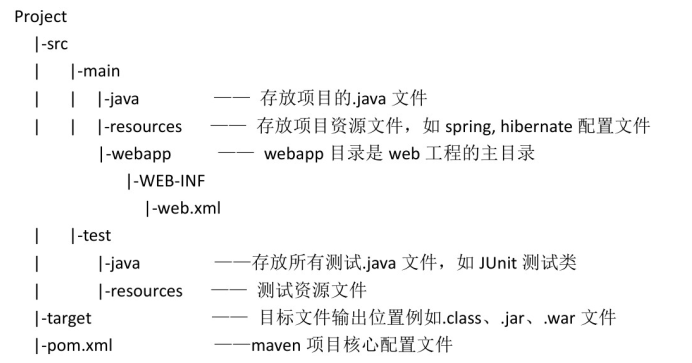

### 1.6.3 Maven 常用命令

依据上述目录规范创建一个web项目，

#### compile

Compile 是maven 编译命令,作用是将src/main/java
下的文件编译为.class文件输出到target目录下

进入项目根目录，执行 mvn compile

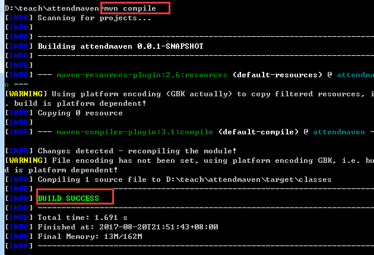

查看target 目录，编译文件已经生成

#### test

Test为maven 单元测试类，会运行src/java/test 下的类，

在cmd 中输入 mvn test

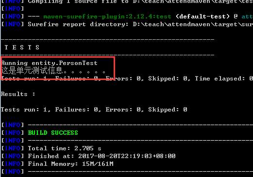

#### clean

Clean为 maven 的清除命令。执行该命令会清除target目录的内容

#### package

Package为maven 的打包命令，Java 项目打成jar,web项目打成war 包

#### install 

发布命令，将项目打成jar 或war 发布到本地仓库中

#### deploy

发布命令，将项目打成jar 或war 发布到远程仓库(私服)

1.7 Maven的概念模型
---------------

### 1.7.1 项目对象模型

一个maven 项目对应一个pom.xml
文件，通过pom.xml文件定义项目的坐标、项目依赖、项目信息等

### 1.7.2 项目依赖管理系统

通过maven 的项目依赖管理，对项目所依赖的jar包统一管理。

上边的项目依赖junit jar，通过在pom.xml中配置junit 依赖。

`| \<!-- 项目依赖 集合--\> \<dependencies\> \<!--单个依赖 --\> \<dependency\> \<!-- 依赖的组织或模块 --\> \<groupId\>*junit*\</groupId\> \<!-- -依赖的模块 --\> \<artifactId\>*junit*\</artifactId\> \<!-- 依赖的模块版本 --\> \<version\>4.9\</version\> \<!-- 依赖的范围 --\> \<scope\>test\</scope\> \</dependency\> \</dependencies\> |`
`|----------------------------------------------------------------------------------------------------------------------------------------------------------------------------------------------------------------------------------------------------------------------------------------------------------------------------------------|`

1.8 Maven 在eclipse 中使用配置
--------------------------

Eclipse 中已经集成了maven ,所以不需要单独安装了。但是需要一些设置

### 1.8.1 指定maven 的安装路径

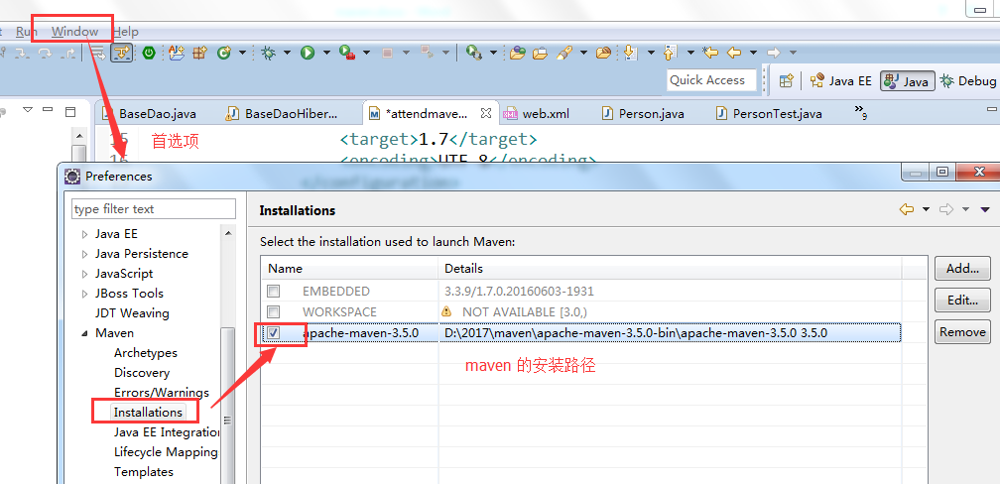

### 1.8.2 User settings的设置

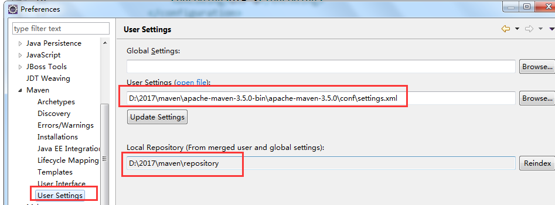

### 1.8.3 Eclipse 浏览仓库

Window –showview –other

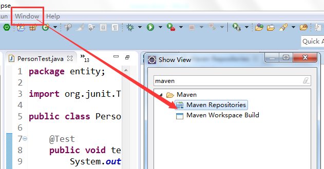

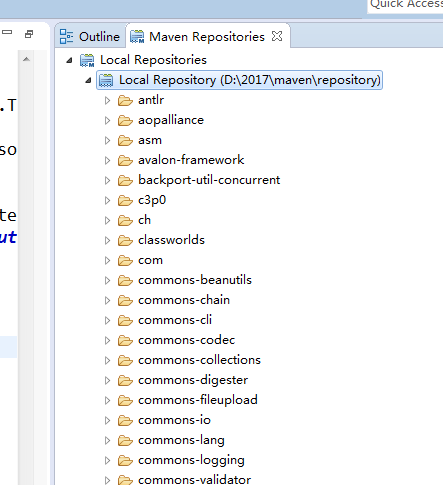

### 1.8.5 Maven坐标定义

坐标是maven 对jar 包的身份定义，所以每个maven 项目都需要定义本工程的坐标。如：

| \<!—项目名称 \<!-- 公司名称或组织名称 --\> \<groupId\>com.hrxb\</groupId\> \<!-- 项目或模块名称 --\> \<artifactId\>*attendmaven*\</artifactId\> \<!-- 项目或模块版本 --\> \<version\>0.0.1-SNAPSHOT\</version\> \<!-- 项目或模块的打包类型 war： web项目 jar :Java项目 *pom*:父工程设置为*pom* --\> \<packaging\>war\</packaging\> |
|------------------------------------------------------------------------------------------------------------------------------------------------------------------------------------------------------------------------------------------------------------------------------------------------------------------------------------|

1.9 Maven构建web 工程
-----------------

### 1.9.1 业务需求

创建一个web 工程，使用struts2
实现，在浏览器输入http://127.0.0.1:8080/maven/helloMaven 页面跳转到 index.jsp
页面并显示 hello maven.

### 1.9.2 开发步骤

1.  新建项目 other ，创建maven project

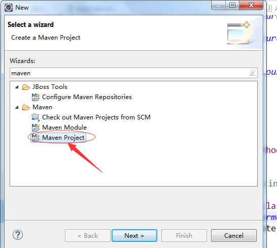

1.  跳过模板选择如下图

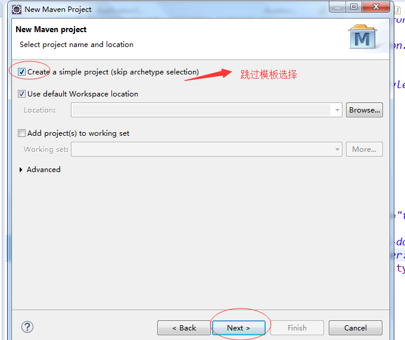

1.  定义坐标

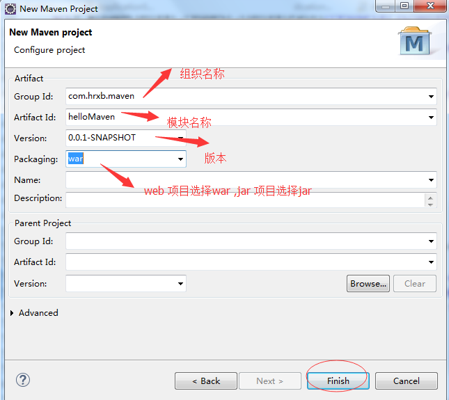

1.  点finish后形成的结果如下图

1.  处理项目错误

>   Maven 默认不会创建web.xml文件，需要手工创建，注意需要在WEB-INF 下创建
>   web.xml ,如下图

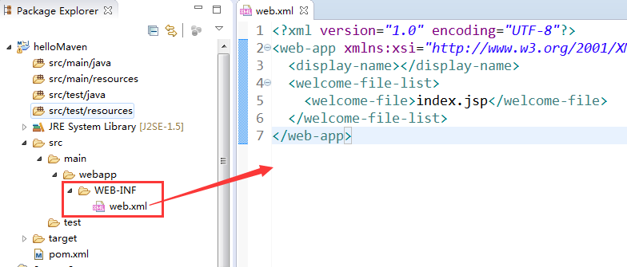

也可以用eclipse自动生成 .如下:

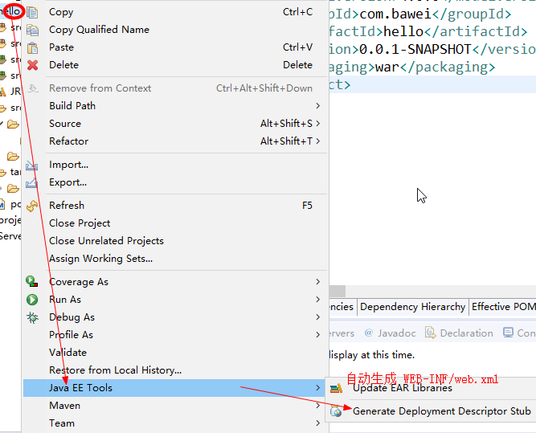

1.  处理设置项目的编译版本

>   项目创建好以后，默认的编译版本为1.5，本教程使用jdk8，所以需要重新设置编译的版本为Jdk8

，需要在pom.xml 中加入

| \<build\> \<plugins\> \<plugin\> |
|----------------------------------|

>   \<groupId\>org.apache.maven.plugins\</groupId\>

\<artifactId\>*maven*-compiler-*plugin*\</artifactId\>

\<version\>3.5.1\</version\>

\<configuration\>

\<source\>1.8\</source\>

\<target\>1.8\</target\>

\<encoding\>UTF-8\</encoding\>

\</configuration\>

\</plugin\>

\</plugins\>

\</build\>

>   右键项目—maven—update project

1.  使用pom.xml 加入struts2 需要的相关jar，向pom.xml中添加依赖

| \<dependencies\> \<dependency\> \<groupId\>org.apache.struts\</groupId\> \<artifactId\>struts2-core\</artifactId\> \<version\>2.3.24\</version\> \</dependency\> \</dependencies\> |
|------------------------------------------------------------------------------------------------------------------------------------------------------------------------------------|

添加完以后，项目目录出现

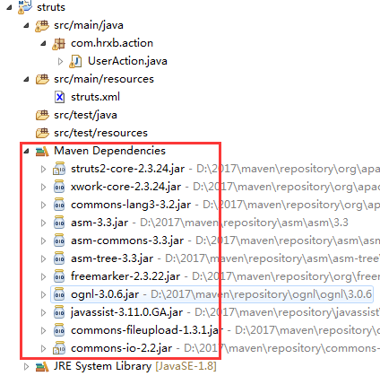

1.  开发action

1.  配置struts.xml文件

>   在src/main/resources 下加入struts.xml文件。如下

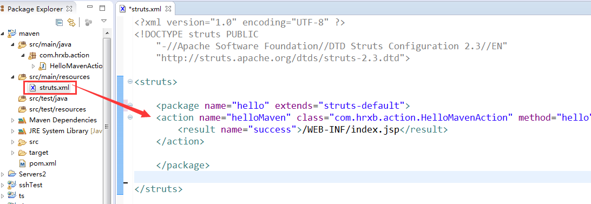

1.  开发jsp  
    

    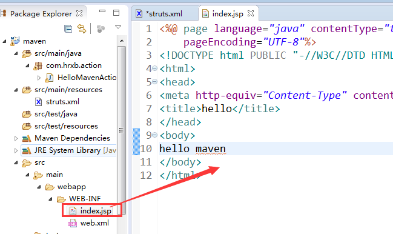

2.  由于 Java 8和tomcat6 不兼容。所以项目要用tomcat 7
    或更高版本来运行。需要单独加入tomcat7 或更高的 插件.否则会报下面的错误

>   解决办法：在pom.xml中加入

| \<plugin\> \<groupId\>org.apache.tomcat.maven\</groupId\> \<artifactId\>tomcat7-*maven*-*plugin*\</artifactId\> \<version\>2.2\</version\> \</plugin\> |
|--------------------------------------------------------------------------------------------------------------------------------------------------------|

1.  运行tomcat

>   右键项目 run as

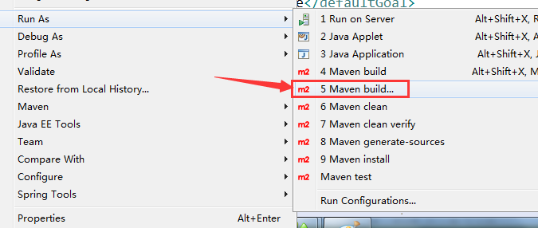

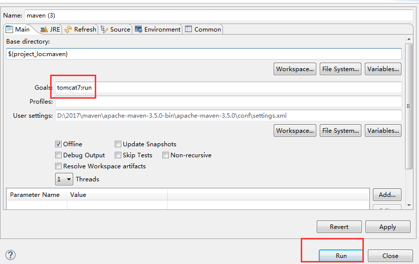

1.  启动成功后，在地址栏输入

>   http://localhost:8080/maven/helloMaven

1.10 eclipse 下maven 命令的使用
--------------------------

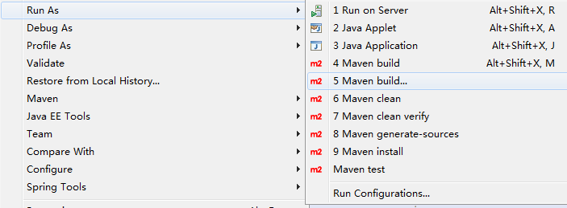

Run as 采用mvn 的命令运行 。debug as 采用mvndebug 的命令运行

Maven clean 清楚target 目录

Maven test 运行单元测试

Maven intstall 将项目打包发布到本地仓库

Maven deploy将项目打包发布到远程仓库

Maven build 运行之前操作过的命令

Maven build …手动输入命令 ，如下

