第三单元 Maven聚合与继承开发
============================

【授课重点】
============

1.  maven的多模块开发;

2.  多模块开发的聚合;

3.  子模块继承父工程;

4.  多模块maven工程的构建过程;

【考核要求】
============

1.  什么是多模块开发

2.  多模块开发之项目继承

3.  把单一项目拆分成多模块聚合结构

【教学内容】
============

3.1 课堂导入
--------

3.2 构建多模块开发maven项目
-----------------------

### 3.2.1  什么是多模块开发及其好处 

把项目按照业务功能分成多个子模块,每个子模块可完成相应的功能。如电子商务网站可分为:商品管理子模块,订单管理子模块,用户管理子模块等.

好处:

1.  模块可重用,如订单和商品管理都需要查询商品,则可使用同一个业务查询逻辑

2.  灵活性,多人协作开发

3.  代码解耦,每个模块都可以独立部署

使用场景:

　Maven多模块项目,适用于一些比较大的项目，通过合理的模块拆分，实现代码的复用，便于维护和管理。尤其是一些开源框架，也是采用多模块的方式，提供插件集成，用户可以根据需要配置指定的模块

### 3.2.2 示例:前后端开发

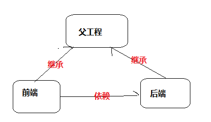

1.  建立父工程

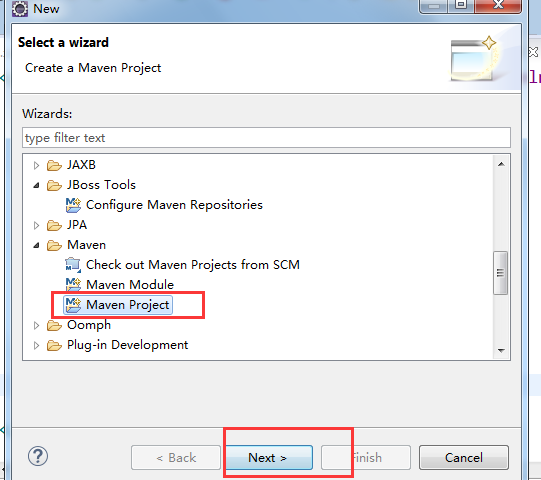

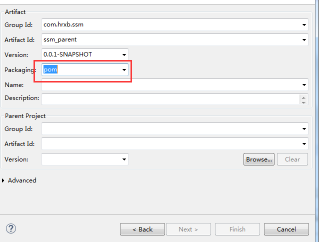

>   在父工程的pom.xml，维护该项目需要用的jar的版本，编译版本,tomcat等信息

>   Pom.xml 内容

>   把该项目打包发布到本地仓库

1.  建立后端子模块

>   选中ssm_parent右键 新建

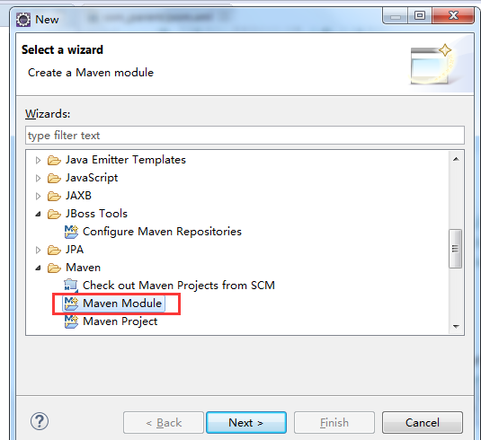

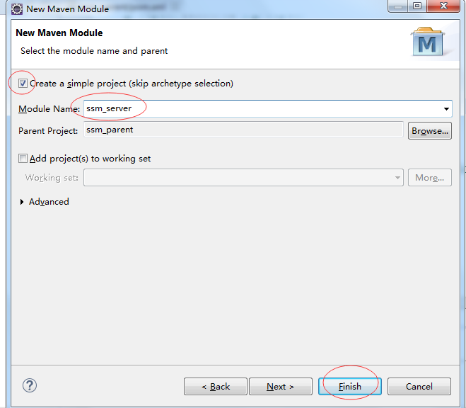

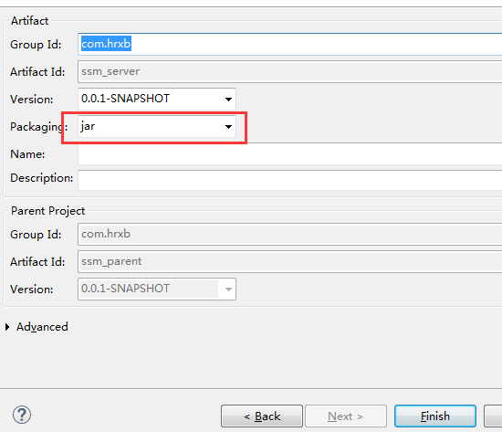

>   把项目发布到本地仓库

### 3.2.3 建立前端子模块

右键ssm_server 新建

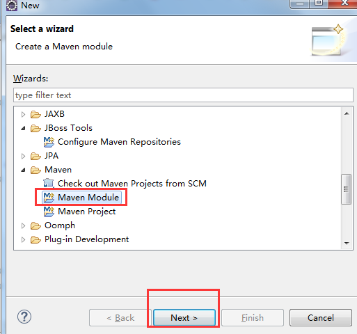

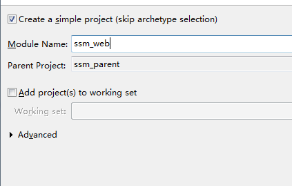

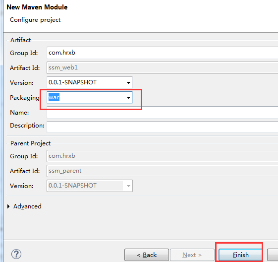

### 3.2.4 最终项目结构

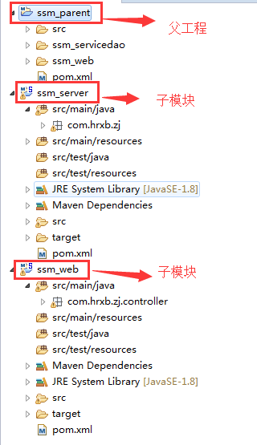

 3.3 Pom.xml
--------

###  3.3.1 Service 模块

```
		<!-- spring 及springMVC -->
		<dependency>
			<groupId>org.springframework</groupId>
			<artifactId>spring-core</artifactId>
		</dependency>
		<dependency>
			<groupId>org.springframework</groupId>
			<artifactId>spring-context</artifactId>
		</dependency>
		<dependency>
			<groupId>org.springframework</groupId>
			<artifactId>spring-beans</artifactId>
		</dependency>
		<dependency>
			<groupId>org.springframework</groupId>
			<artifactId>spring-web</artifactId>
		</dependency>
		<dependency>
			<groupId>org.springframework</groupId>
			<artifactId>spring-webmvc</artifactId>
		</dependency>
		<dependency>
			<groupId>org.springframework</groupId>
			<artifactId>spring-jdbc</artifactId>
		</dependency>
		<dependency>
			<groupId>org.springframework</groupId>
			<artifactId>spring-tx</artifactId>
		</dependency>
		<dependency>
			<groupId>org.springframework</groupId>
			<artifactId>spring-context-support</artifactId>
		</dependency>
		<!-- mybatis核心包 -->
		<dependency>
			<groupId>org.mybatis</groupId>
			<artifactId>mybatis</artifactId>
		</dependency>
		<!-- mybatis-spring 整合jar -->
		<dependency>
			<groupId>org.mybatis</groupId>
			<artifactId>mybatis-spring</artifactId>
		</dependency>
		<!-- druid数据源 -->
		<dependency>
			<groupId>com.alibaba</groupId>
			<artifactId>druid</artifactId>
		</dependency>
		<!-- Mysql数据库驱动包 -->
		<dependency>
			<groupId>mysql</groupId>
			<artifactId>mysql-connector-java</artifactId>
		</dependency>
		<!-- 日志文件管理包 -->
		<!-- log start -->
		<dependency>
			<groupId>log4j</groupId>
			<artifactId>log4j</artifactId>
		</dependency>
		 <!-- 依赖的公共包 -->
		<dependency>
			<groupId>org.apache.commons</groupId>
			<artifactId>commons-lang3</artifactId>
		</dependency>

		<dependency>
			<groupId>org.aspectj</groupId>
			<artifactId>aspectjweaver</artifactId>
		</dependency>
		<dependency>
			<groupId>org.aspectj</groupId>
			<artifactId>aspectjrt</artifactId>
		</dependency>
		<dependency>
			<groupId>com.github.pagehelper</groupId>
			<artifactId>pagehelper</artifactId>
		</dependency>
  </dependencies>
```


###  3.3.2 前端pom

```
     <dependencies>
			<!-- 上传组件包 -->
		<dependency>
			<groupId>commons-fileupload</groupId>
			<artifactId>commons-fileupload</artifactId>
		</dependency>
		<dependency>
			<groupId>commons-io</groupId>
			<artifactId>commons-io</artifactId>
		</dependency>
		<dependency>
			<groupId>org.apache.poi</groupId>
			<artifactId>poi</artifactId>
		</dependency>
		<!-- JSP相关 -->
		<dependency>
			<groupId>jstl</groupId>
			<artifactId>jstl</artifactId>
		</dependency>
		<dependency>
			<groupId>javax.servlet.jsp</groupId>
			<artifactId>jsp-api</artifactId>
			<scope>provided</scope>
		</dependency>
		<dependency>
			<groupId>javax.servlet</groupId>
			<artifactId>servlet-api</artifactId>
			<scope>provided</scope>
		</dependency>

		<dependency>
			<groupId>com.fasterxml.jackson.core</groupId>
			<artifactId>jackson-databind</artifactId>
		</dependency>
	</dependencies>
	
```


 3.4 依赖关系
---------

前端的运行依赖后端的服务，在ssm_web 的pom.xml中，加入server的依赖

​	

```
  <dependencies>
  	<dependency>
  		<groupId>com.hrxb</groupId>
  		<artifactId>ssm_server</artifactId>
  		<version>0.0.1-SNAPSHOT</version>
  	</dependency>
  </dependencies>
```


3.5 其他配置说明 
-------------

### 3.5.1 在ssm_web中web.xml 配置如下


<?xml version=*"1.0"* encoding=*"UTF-8"*?>

<web-app xmlns:xsi=*"http://www.w3.org/2001/XMLSchema-instance"* xmlns=*"http://java.sun.com/xml/ns/javaee"* 

   xmlns:web=*"http://java.sun.com/xml/ns/javaee/web-app_2_5.xsd"* xsi:schemaLocation=*"http://java.sun.com/xml/ns/javaee http://java.sun.com/xml/ns/javaee/web-app_2_5.xsd"* version=*"2.5"*>

  <display-name></display-name>

  <welcome-file-list>

​    <welcome-file>index.jsp</welcome-file>

  </welcome-file-list>

 

  <!-- 启动spring -->

   <listener>

​    <listener-class>org.springframework.web.context.ContextLoaderListener</listener-class>

  </listener>

  <context-param>

​    <param-name>contextConfigLocation</param-name>

​    <param-value>classpath:applicationContext.xml</param-value>

  </context-param>

  <servlet>

​    <servlet-name>springmvc</servlet-name>

<servlet-class>org.springframework.web.servlet.DispatcherServlet</servlet-class>

 

​    <init-param>

​      <param-name>contextConfigLocation</param-name>

​      <param-value>classpath:springmvc.xml</param-value>

​    </init-param>	

  </servlet>

  <servlet-mapping>

​    <servlet-name>springmvc</servlet-name>

​    <!-- 拦截所有请求 -->

​    <url-pattern>/</url-pattern>

  </servlet-mapping>

  

  <filter>

​    <filter-name>CharacterEncodingFilter</filter-name>

​    <filter-class>org.springframework.web.filter.CharacterEncodingFilter</filter-class>

​    <init-param>

​      <param-name>encoding</param-name>

​      <param-value>utf-8</param-value>

​    </init-param>

  </filter>

  <filter-mapping>

​    <filter-name>CharacterEncodingFilter</filter-name>

​    <url-pattern>/*</url-pattern>

  </filter-mapping>

  

​        <error-page>

​		<error-code>404</error-code>

​		<location>/WEB-INF/view/404.jsp</location>

​	   </error-page>

</web-app>


### 3.5.2 资源文件

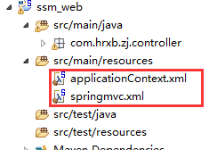

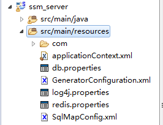

 3.6 运行
-----

在 ssm_web 点run as tomat7:run

或者在父工程点run as tomat7:run

3.7 多模块的maven工程构建过程
-------------------------

Maven按序读取POM，如果该POM没有继承模块，就构建该模块，否则就先构建其继承的模块，如果该继承的模块还继承其它模块，则进一步先构建继承的模块。在此过程中，构建过的模块不再构建。（反应堆：所有模块组成的构建结构，包含了模块间的继承关系，能够计算出模块的构建顺序）

假设A项目聚合了B、C项目，B、C项目继承D项目，D继承E，则构建顺序为：A、E、D、B、C。
