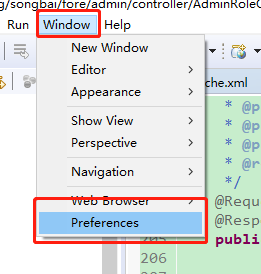
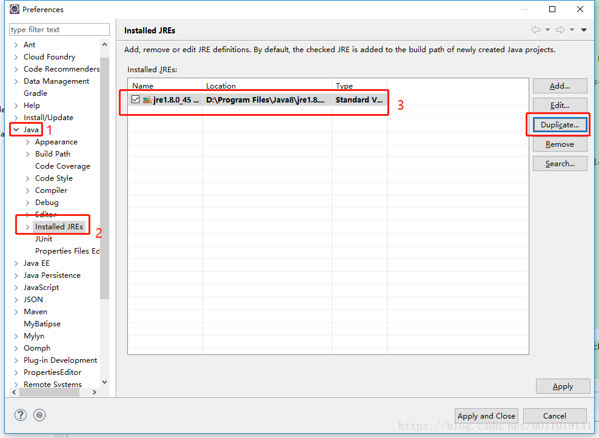
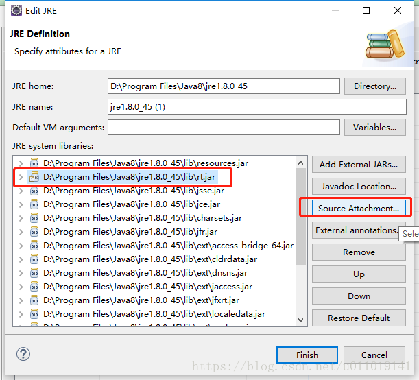
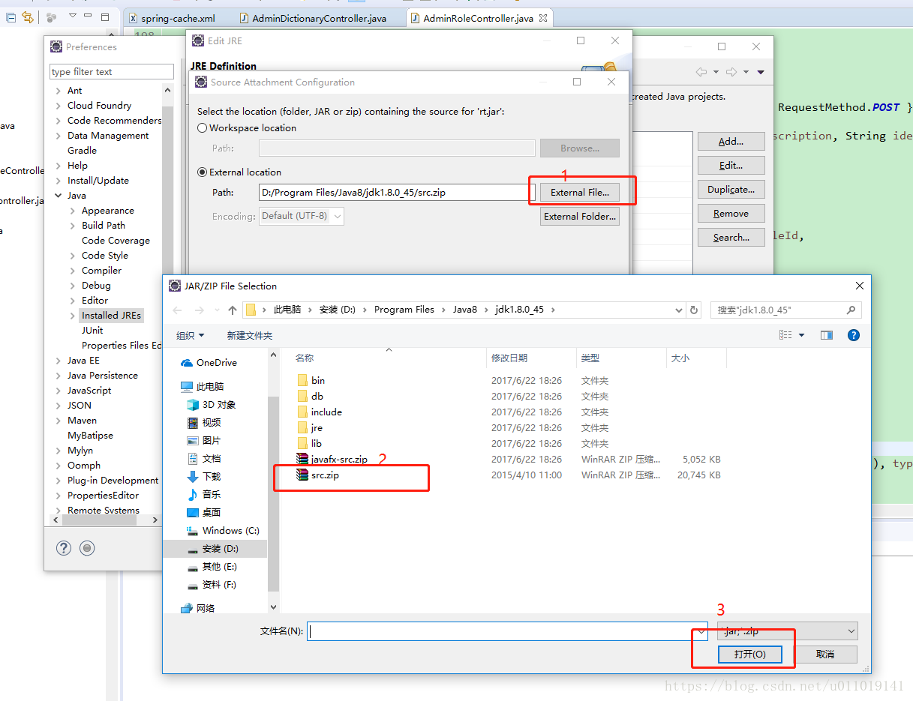
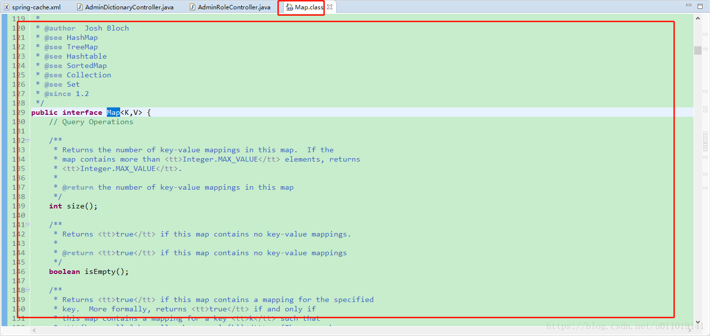
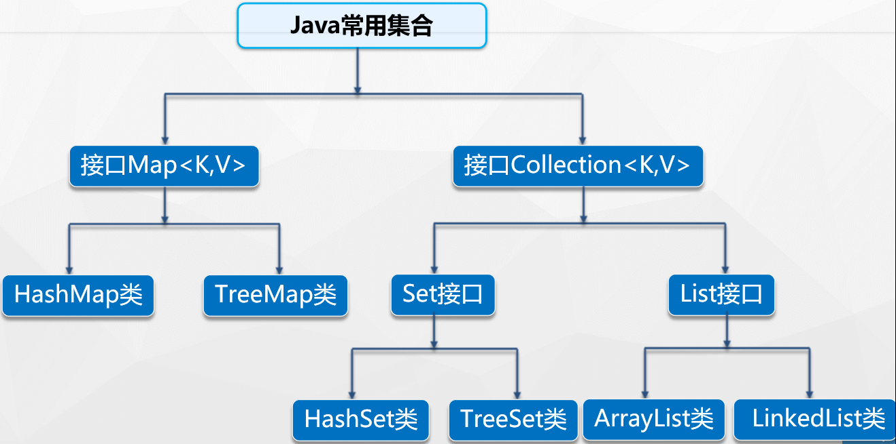
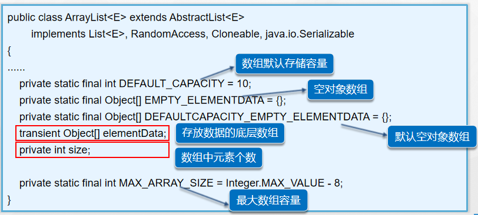

第八单元Collection的源码分析
============================

【授课重点】
============

1.  如何查看源代码

2.  常用集合类和接口之间的关系

3.  常用的存储方式

4.  常用集合类的线程安全、效率等特性分析

【考核要求】
============

1.  掌握如何查看源码

2.  明确集合类和接口之间的关系

3.  常用存储方式理解透彻（set 、 map 、list ）

4.  掌握不同集合类之间的线程安全性和效率的差异

【教学内容】
============

8.1 课程导入
--------

集合底层原理

提高遍程代码质量

8.2 如何产看源码
------------

安装好JDK后，在jdk安装目录下会有一个src.zip的压缩包，所以我们只要设置eclipse和这个包关联起来就可以查看源码了。

查看源码最快捷方式，按住键盘ctrl键鼠标选择你想要查看源码的类或者方法名即可。

步骤一：

>   IMG_256

步骤二：

>   IMG_256

步骤三：

>   IMG_256

步骤四：

>   IMG_256

步骤五：

>   IMG_256

之后的事情就是一路的OK即可。

8.3 集合类之间的关系
----------------

图形说明：

>   虚线+空心箭头： 表示接口之间（或者抽象类实现接口）的继承。

>   实心箭头： 表示依赖关系

>   实线+空心箭头： 表示实现接口或者实现抽象类（实现==实线）。

>   短虚线边框： 接口

>   长虚线边框： 抽象类

>   实线边框： 实现类

简化记忆图形：

8.4 集合类型介绍
------------

-   List

-   Set

-   Map

8.5 预备知识
--------

### 8.5.1 线程安全

-   **线程安全：**

>   当多线程访问时，采用了加锁的机制；即当一个线程访问该类的某个数据时，会对这个数据进行保护，其他线程不能对其访问，直到该线程读取完之后，其他线程才可以使用。防止出现数据不一致或者数据被污染的情况。

-   **线程不安全**

>   就是不提供数据访问时的数据保护，多个线程能够同时操作某个数据，从而出现数据不一致或者数据污染的情况。对于线程不安全的问题，一般会使用synchronized关键字加锁同步控制

-   **线程安全工作原理**

>    jvm中有一个main memory对象，每一个线程也有自己的working
>   memory，一个线程对于一个变量(variable)进行操作的时候， 都需要在自己的working
>   memory里创建一个copy,操作完之后再写入main memory。
>   当多个线程操作同一个变量(variable)，就可能出现不可预知的结果。   
>   而用synchronized的关键是建立一个监控(monitor)，这个monitor可以是要修改的变量，也可以是其他自己认为合适的对象(方法)，然后通过给这个monitor加锁来实现线程安全，每个线程在获得这个锁之后，要执行完加载(load)到working
>   memory 到使用并指派到存储 再到 main
>   memory的过程。最后才会释放它得到的锁。这样就实现了所谓的线程安全。

### 8.5.2 容量

>   最多能够容纳的数量

### 8.5.3 加载因子

需要扩容的临界点。也就是需要扩容时所包含的数量与容量的壁纸。

8.6 List
----

## 8.7 Vector

>   Vector与ArrayList一样，都是通过数组实现的，不同的是它支持线程的同步，即某一时刻只有一个线程能够写Vector，避免多线程同时写而引起的不一致性，但实现同步需要很高的花费，因此，访问它比访问ArrayList慢。主要用在事先不知道数组的大小，以及需要频繁地进行查找，插入，删除工作

-   **Vector类支持4种构造方法**

第一种构造方法创建一个默认的容量，默认大小为10：

Vector()

第二种构造方法创建指定大小的向量。

Vector(int size)

第三种构造方法创建指定大小的向量，并且增量用incr指定.
增量表示向量每次增加的元素数目（当该vector对象添加的元素接近原先分配的内存极限时，会以incr大小自动扩大该对象拥有的内存容量，以容纳更多的数据）

Vector(int size,int incr)

第四中构造方法创建一个包含集合c元素的向量：利用父类对象创建子类对象

Vector(Collection c)

-   **Vector的增加**

vec.add(E element) ： 将指定元素追加到此向量的末尾。 

vec.add(int index, E element) ：在此向量的指定位置插入指定的元素。   
vec.addAll(Collection c) ：将指定 Collection
中的所有元素按顺序追加到此向量的末尾。   
vec.addAll(int index, Collection c) ：在指定位置将指定 Collection
中的所有元素插入到此向量中。

-   **Vector的删除**

vec.remove(int index)   
移除此向量中指定位置的元素。   
vec.remove(value v)   
移除向量中元素值为v的元素。  
vec.removeAll(Collection c)   
从此向量中移除包含在集合c 中的所有元素。   
vec.removeAllElements()   
从此向量中移除全部组件，并将其大小设置为零。   
vec.removeRange(int fromIndex, int toIndex)   
移除位于 fromIndex（包括）与 toIndex（不包括）之间的所有元素。

vec.clear() 移除所有元素。

-   **Vector的查询**

vec.get(int index)

>   返回向量中指定位置的元素。   
>   vex.indexOf(value v)   
>   返回v值在vec中的下标。  
>   vec.isEmpty()   
>   检查该向量是否为空。   
>   vec.lastElement()   
>   返回此向量的最后一个元素。

>   int capacity()   
>   返回此向量的当前容量。

>   int size()   
>   返回此向量中的组件数。

>   String toString()   
>   返回此向量的字符串表示形式，其中包含每个元素的 String 表示形式。

-   **Vector**

>   vec.set(int index, E element)   
>   用指定的元素替换此向量中指定位置处的元素。   
>   vex.setElementAt(E obj, int index)   
>   将此向量指定 index 处的组件设置为指定的对象。   
>   vec.setSize(int newSize)   
>   设置此向量的大小。

## 8.7 ArrayList

a.
当操作是在一列数据的后面添加数据而不是在前面或者中间，并需要随机地访问其中的元素时，使用ArrayList性能比较好。   
　　b.
ArrayList是最常用的List实现类，内部是通过数组实现的，它允许对元素进行快速随机访问。数组的缺点是每个元素之间不能有间隔，当数组大小不满足时需要增加存储能力，就要讲已经有数组的数据复制到新的存储空间中。当从ArrayList的中间位置插入或者删除元素时，需要对数组进行复制、移动、代价比较高。因此，它**适合随机查找和遍历，不适合插入和删除。 **

>   ArrayList就是动态的数组，可以动态的增加和减少元素，灵活的设置数组的大小。基本与Vector一样。

-   **ArrayList构造方法**

public ArrayList();   
默认的构造器，将会以默认（10）的大小来初始化内部的数组   
public ArrayList(Collection c);   
用一个集合对象来构造，并将该集合的元素添加到ArrayList   
public ArrayList(int n);   
用指定n的大小来初始化内部的数组.

 

 

-   **ArrayList的增加**

**add**(E e)   将指定的元素添加到此列表的尾部。

**add**(int index, E element)  将指定的元素插入此列表中的指定位置。

**addAll**(Collection\<? extends E\> c) 按照指定 collection
的迭代器所返回的元素顺序，将该 collection 中的所有元素添加到此列表的尾部。

**addAll**(int index, Collection\<? extends E\> c) 从指定的位置开始，将指定
collection 中的所有元素插入到此列表中。

-   **ArrayList的删除**

**remove**(int index)    移除此列表中指定位置上的元素。

**remove**(Object o) 移除此列表中首次出现的指定元素（如果存在）。

**removeRange**(int fromIndex,
int toIndex) 移除列表中索引在 fromIndex（包括）和 toIndex（不包括）之间的所有元素。

**clear**()  移除此列表中的所有元素。

-   **ArrayList的查询**

**get**(int index)     返回此列表中指定位置上的元素。

**indexOf**(Object o) 返回此列表中首次出现的指定元素的索引，或如果此列表不包含元素，则返回
-1。

**isEmpty**()    如果此列表中没有元素，则返回 true

**size**()    返回此列表中的元素数。

**contains**(Object o)  如果此列表中包含指定的元素，则返回 true。

-   **ArrayList的改**

**set**(int index, E element)  用指定的元素替代此列表中指定位置上的元素。

**toArray**()  转为数组

-   **LinkedList**

 

| LinkedList：                                                                                                                                                                                                                                                                                                                                                                                 |
| 　　a. 当对一列数据的前面或者中间执行添加或者删除操作时，并且按照顺序访问其中的元素时，要使用LinkedList。                                                                                                                                                                                                                                                                                    |
| 　　b. LinkedList是用链表结构存储数据的，**很适合数据的动态插入和删除，随机访问和遍历速度比较慢(**LinkedList遍历时建议使用For-each或者迭代器的方式**)**。另外，他还提供了List接口中没有定义的方法，专门用于操作表头和表尾元素，可以当作堆栈、队列和双向队列使用。案例                                                                                                                        |
|----------------------------------------------------------------------------------------------------------------------------------------------------------------------------------------------------------------------------------------------------------------------------------------------------------------------------------------------------------------------------------------------|

>   public class LinkedListTest {

public static void main(String[] args) {

// commonMethods() ; // 测试LinkedList的常用方法

//likeStack();// 将LinkedList当作 LIFO(后进先出)的堆栈

likeQueue(); // 将LinkedList当作 FIFO(先进先出)的队列

}

private static void commonMethods() {

LinkedList\<String\> llist = new LinkedList\<String\>();

llist.add("A");//添加元素

llist.add("B");

llist.add("C");

llist.add("D");

System.out.println("llist-------\>"+llist);

llist.add(1, "E");// 将“E”添加到第索引为1的个位置

System.out.println("添加E到索引为1的个位置后的llist-------\>"+llist);

llist.addFirst("X");// 将“X”添加到第一个位置。 失败的话，抛出异常！

System.out.println("在最前面添加X后的llist-------\>"+llist);

System.out.println("删除第一个元素并获得并返回被删除元素-----\>"+llist.removeFirst());
// 将第一个元素删除。

System.out.println("删除第一个元素后的llist-------\>"+llist);

llist.offerFirst("Y");// 将“Y”添加到第一个位置。 返回true。

System.out.println("将Y添加到第一个位置后的llist-------\>"+llist);

System.out.println("删除第一个元素并获得并返回被删除元素------\>"+llist.pollFirst());
// 将第一个元素删除。

System.out.println("将第一个元素删除后的llist-------\>"+llist);

llist.removeLast() ;

System.out.println("移除最后一个元素后的llist-------\>"+llist);

llist.offerLast("Z"); // 将“Z”添加到最后一个位置

System.out.println("在最后添加Z后的llist-------\>"+llist);

llist.set(2, "M");// 将第3个元素设置M。

System.out.println("将第3个元素设置M后的llist-------\>"+llist);

System.out.println("size:"+llist.size());// LinkedList大小

llist.clear();// 清空LinkedList

}

private static void likeStack() { //将LinkedList作为栈使用!!!!!!!!!!!!

LinkedList\<String\> stack = new LinkedList\<String\>();

stack.push("A");//向栈中添加元素

stack.push("B");

stack.push("C");

stack.push("D");

System.out.println("stack---------\>"+stack);

stack.pop() ;// 删除“栈顶元素”

System.out.println("删除栈顶后的stack---------\>"+stack);

System.out.println("栈顶元素---------\>"+stack.peek()); // 取出栈顶

}

private static void likeQueue() {//将LinkedList作为队列使用!!!!!!!!!!!!

LinkedList\<String\> queue = new LinkedList\<String\>();

queue.add("A");//向队列中添加元素

queue.add("B");

queue.add("C");

queue.add("D");

System.out.println("queue---------\>"+queue);

queue.remove() ;//删除队列的第一个元素

System.out.println("删除队列的第一个元素后queue---------\>"+queue);

System.out.println("队列第一个元素-------\>"+queue.element()); //
读取队列的第一个元素

}

}

## 8.8 LinkedList

 

| LinkedList：                                                                                                                                                                                                                                                                                                                                                                                 |
| 　　a. 当对一列数据的前面或者中间执行添加或者删除操作时，并且按照顺序访问其中的元素时，要使用LinkedList。                                                                                                                                                                                                                                                                                    |
| 　　b. LinkedList是用链表结构存储数据的，**很适合数据的动态插入和删除，随机访问和遍历速度比较慢(**LinkedList遍历时建议使用For-each或者迭代器的方式**)**。另外，他还提供了List接口中没有定义的方法，专门用于操作表头和表尾元素，可以当作堆栈、队列和双向队列使用。案例                                                                                                                        |
|----------------------------------------------------------------------------------------------------------------------------------------------------------------------------------------------------------------------------------------------------------------------------------------------------------------------------------------------------------------------------------------------|

>   public class LinkedListTest {

public static void main(String[] args) {

// commonMethods() ; // 测试LinkedList的常用方法

//likeStack();// 将LinkedList当作 LIFO(后进先出)的堆栈

likeQueue(); // 将LinkedList当作 FIFO(先进先出)的队列

}

private static void commonMethods() {

LinkedList\<String\> llist = new LinkedList\<String\>();

llist.add("A");//添加元素

llist.add("B");

llist.add("C");

llist.add("D");

System.out.println("llist-------\>"+llist);

llist.add(1, "E");// 将“E”添加到第索引为1的个位置

System.out.println("添加E到索引为1的个位置后的llist-------\>"+llist);

llist.addFirst("X");// 将“X”添加到第一个位置。 失败的话，抛出异常！

System.out.println("在最前面添加X后的llist-------\>"+llist);

System.out.println("删除第一个元素并获得并返回被删除元素-----\>"+llist.removeFirst());
// 将第一个元素删除。

System.out.println("删除第一个元素后的llist-------\>"+llist);

llist.offerFirst("Y");// 将“Y”添加到第一个位置。 返回true。

System.out.println("将Y添加到第一个位置后的llist-------\>"+llist);

System.out.println("删除第一个元素并获得并返回被删除元素------\>"+llist.pollFirst());
// 将第一个元素删除。

System.out.println("将第一个元素删除后的llist-------\>"+llist);

llist.removeLast() ;

System.out.println("移除最后一个元素后的llist-------\>"+llist);

llist.offerLast("Z"); // 将“Z”添加到最后一个位置

System.out.println("在最后添加Z后的llist-------\>"+llist);

llist.set(2, "M");// 将第3个元素设置M。

System.out.println("将第3个元素设置M后的llist-------\>"+llist);

System.out.println("size:"+llist.size());// LinkedList大小

llist.clear();// 清空LinkedList

}

private static void likeStack() { //将LinkedList作为栈使用!!!!!!!!!!!!

LinkedList\<String\> stack = new LinkedList\<String\>();

stack.push("A");//向栈中添加元素

stack.push("B");

stack.push("C");

stack.push("D");

System.out.println("stack---------\>"+stack);

stack.pop() ;// 删除“栈顶元素”

System.out.println("删除栈顶后的stack---------\>"+stack);

System.out.println("栈顶元素---------\>"+stack.peek()); // 取出栈顶

}

private static void likeQueue() {//将LinkedList作为队列使用!!!!!!!!!!!!

LinkedList\<String\> queue = new LinkedList\<String\>();

queue.add("A");//向队列中添加元素

queue.add("B");

queue.add("C");

queue.add("D");

System.out.println("queue---------\>"+queue);

queue.remove() ;//删除队列的第一个元素

System.out.println("删除队列的第一个元素后queue---------\>"+queue);

System.out.println("队列第一个元素-------\>"+queue.element()); //
读取队列的第一个元素

}

}

## 8.9 Map

-   **HashMap**  
    a. 采用**数组方式存储key-value**构成的Node对象，无容量限制；   
    b. 基于**key
    hash查找**Node对象存放到数组的位置，对于hash冲突采用链表的方式去解决；   
    c.
    在插入元素时，可能会扩大数组的容量，在扩大容量时须要重新计算hash，并复制对象到新的数组中；   
    d. 是**非线程安全**的；   
    e. 遍历使用的是**Iterator**迭代器；
-   **HashTable： **  
    a. 是**线程安全**的；   
    b.
    无论是key还是value**都不允许有null值的存在**；在HashTable中调用Put方法时，如果key为null，直接抛出NullPointerException异常；   
    c. 遍历使用的是**Enumeration**列举；
-   **TreeMap： **  
    a. 典型的基于红黑树的Map实现，因此它要求一定要有key比较的方法，要么传入
    Comparator比较器实现，要么key对象实现Comparator接口；   
    b. 是非线程安全的；
-   

## 8.9 Set

- **HashSet： **  
  a. 基于HashMap实现，无容量限制；   
  b. 是**非线程安全**的；   
  c. **不保证数据的有序**；

- **TreeSet**  
  a. 基于TreeMap实现的，支持排序；   
  b. 是非线程安全的；

  

# 8.10  课堂小节

 	1. 如何查看源代码
 	2. 讲述常用集合类和接口之间的关系
 	3. 介绍掌握常用的存储方式
 	4. 如何分析常用集合类的线程安全、效率等特性等

# 8.11  课后作业

       1.  分析Hashtable源码 包含扩容机制  线程安全等
       2.  分析ConcurrentHashMap源码，如何保证线程安全和效率的

​	