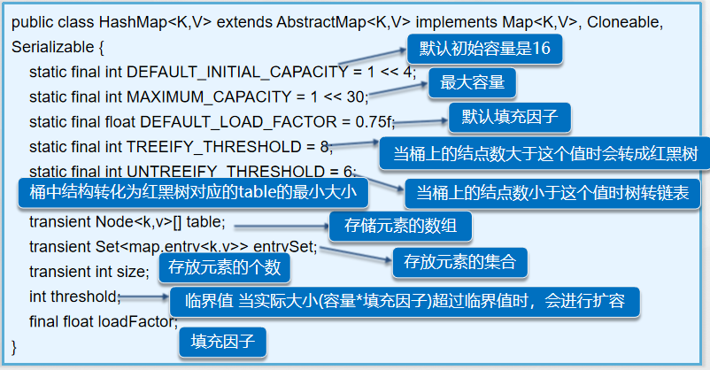
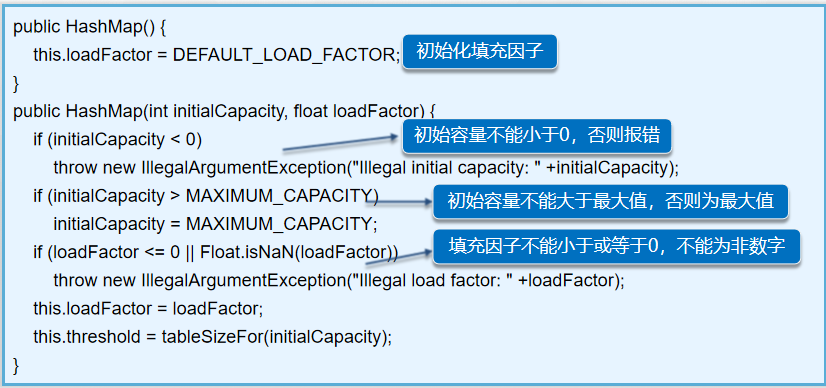
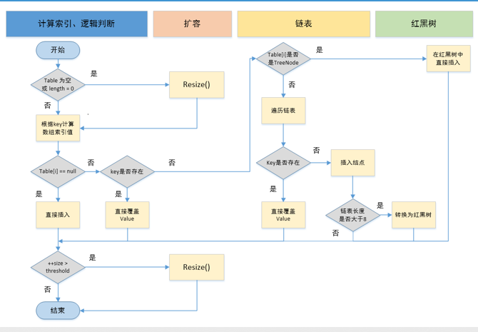
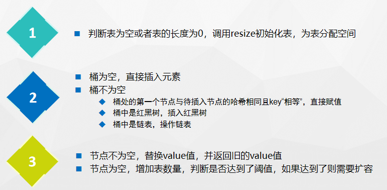
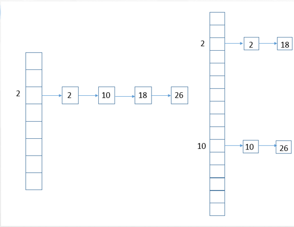
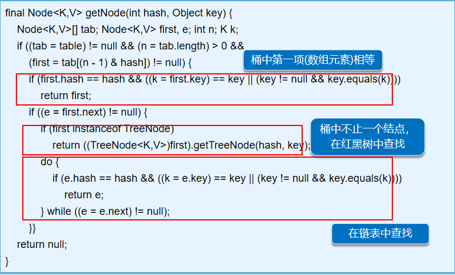
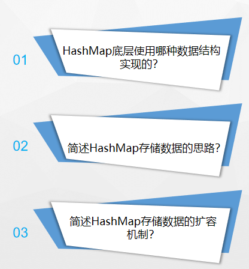
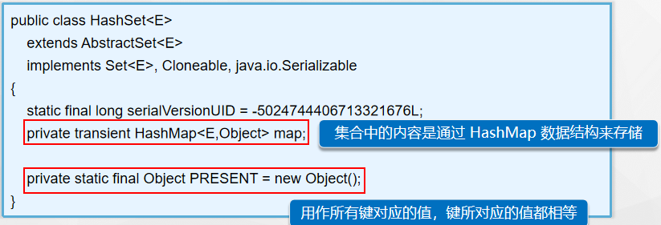
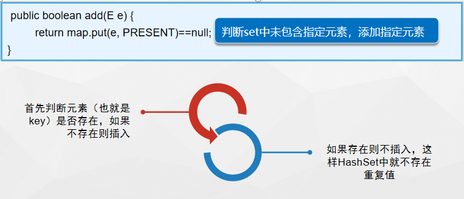
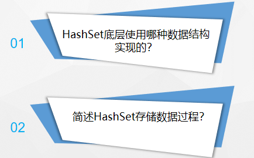

第九单元 HashMap&hashSet 源码分析
=================================

【授课重点】
============

1.  如何查看java的源码；

2.  通过查看HashMap类的属性,构造,核心函数读取\\存储\\删除来解析HashMap\\HashSet；

【考核要求】
============

1.  掌握hashMap的加载因子,扩容机制

2.  掌握hashMap的线程安全

3.  掌握hashMap的哈希值

4.  掌握hashMap的Entry数组

【教学内容】
============

9.1 课程导入
--------

### 9.1.1 学习源代码的益处

1.  能接触java的真实面貌

2.  能更早的进入到java大神的行列

3.  能够获取到更多面试机会

9.2 HashMap分析
-----------

### 9.2.1 hashMap的底层存储

hashMap = 数组 +链表 + 红黑树

 

### 9.2.2  HashMap集合源码解析步骤

 

### 类的属性

 

### 9.2.3  类的构造方法

 

### 9.2.3  核心函数-存储

 

### 9.2.4 核心函数-putVal方法执行过程

 

### 9.2.5 核心函数-存储思路

 

### 9.2.6  核心函数-扩容机制

resize前和resize后的元素布局如下

 

### 9.2.7  核心函数-读取

 

 

### 9.2.8  小结

 

9.3 hashSet分析
-----------

### 9.3.1 HashSet底层存储

HashSet是基于HashMap实现的，HashSet中的元素都存放在HashMap的
key上面，而value中的值都是统一的一个private static final Object PRESENT = new
Object();

### 9.3.2 HashSet集合源码解析步骤

 

### 9.3.3 类的属性

 

### 9.3.4  类的构造方法

 

### 9.3.5 核心函数-存储

 

### 9.3.6 核心读取

 

### 9.3.7 核心函数-删除 

 

## 9.4  课堂小结

 

## 9.5 课后作业

     	1. 背诵扩容机制
     	2. 利用HashMap 实现一文章的单词统计